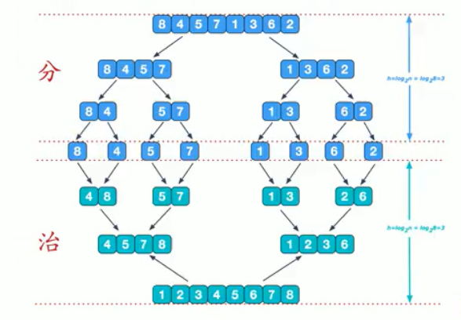
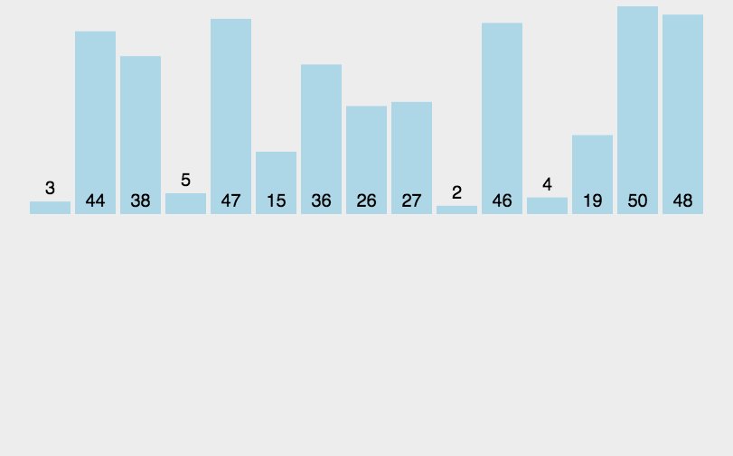
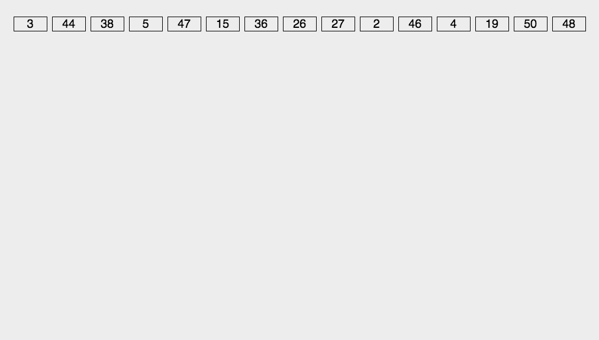
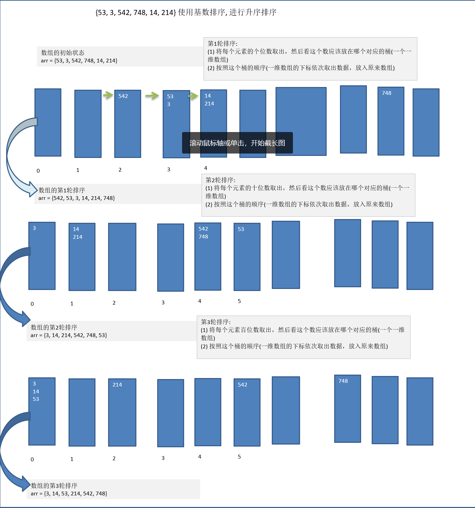

# 数据结构

## 线性结构和非线性结构

数据结构包括：线性结构和非线性结构

### 线性结构：

1. 线性结构作为最常用的数据结构，其特点是数据元素之间存一对一的线性关系
2. 线性结构有两种不同的存储结构，及顺序存储结构和链式存储结构。顺序存储的线性表称为顺序表，顺序表中的存储元素是连续的
3. 链式存储的线性表称为链表，链表中的存储元素不一定是连续的，元素节点中存放数据元素以及相邻元素的地址信息
4. 线性结构常见的有：数组、队列、链表和栈。

### 非线性结构

非线性结构包括：二维数组、多维数组、广义表、树、图。

## 稀疏数组（sparse array）

基本介绍：

当一个数组中大部分元素为0，或者为同一个值的数组时，可以使用稀疏数组来保存该数组。

稀疏数组的处理方法是：

1. 记录数组一共有几行几列，有多少个不同的值
2. 把具有不同值的元素的行列及值记录在一个小规模的数组中，从而缩小程序的规模


二维数组转稀疏数组的思路

1. 遍历原始的二维数组，得到有效数据的个数`sum`

2. 根据`sum`就可以创建稀疏数组`sparseArr= int[sum+1][3]`

3. 将二维数组的有效数据数据存入到稀疏数组

稀疏数组转原始的二维数组的思路

1. 先读取稀疏数组的第一行，根据第一行的数据，创建原始的二维数组，比如上面的 `chessArr2=int[11][11]`
2. 在读取稀疏数组后几行的数据，并赋给原始的二维数组即可。

```java
public class SparseArray {
	public static void main(String[] args) throws IOException {
		/**
		 * 创建一个原始的二维数组 11*11
		 * 0：表示没有棋子，1表示黑子，2表示白子
		 */
		int[][] chessArray = new int[11][11];
		chessArray[1][2] = 1;
		chessArray[2][3] = 2;
		// 输出原始的二维数组
		System.out.println("原始的二维数组:\n");
		toStringArray(chessArray);
		
		/**
		 *  将二维数组转为稀疏数组
		 *  1.先遍历二维数组得到非0数据的个数
		 *  2.创建对应的稀疏数组
		 */
		int effectiveDataCount = 0;
		for(int i = 0; i < 11; i++) {
			for(int j = 0; j<11; j++) {
				if(chessArray[i][j] != 0) {
					effectiveDataCount++;
				}
			}
		}
		/**
		 * 创建对应的稀疏数组,行是有效数据的行数+1
		 * 多出的一行用来存储原二维数组的行和列以及有效数据的个数
		 * 3列是固定值，第一列存储行，第二列存储列，第三列存储实际的值
		 */
		int[][] sparseArray = new int[effectiveDataCount + 1][3];
		// 给稀疏数组赋值，初始化第一行的值
		sparseArray[0][0] = 11;
		sparseArray[0][1] = 11;
		sparseArray[0][2] = effectiveDataCount;
		
		/**
		 * 遍历二维数组，将非0的值存放到稀疏数组中
		 * 再次遍历，如果不进行第一次遍历无法创建稀
		 * 疏数组的大小除非使用集合
		 */
		// 用于记录是第几个非0数据
		int count = 0;
		for(int i = 0; i < 11; i++) {
			for(int j = 0; j<11; j++) {
				if(chessArray[i][j] != 0) {
					count++;
					// 因为count = 0而存值是从第一行开始所以count先++
					sparseArray[count][0] = i;
					sparseArray[count][1] = j;
					sparseArray[count][2] = chessArray[i][j];
				}
			}
		}
		// 输出稀疏数组
		System.out.println("稀疏数组为：\n");
		toStringArray(sparseArray);
		
		/**
		 * 稀疏数组转原始二维数组
		 * 1.先读取稀疏数组的第一行，根据第一行数据创建原始二维数组
		 * 2.读取稀疏数组剩下的行数据，并赋值给原始的二维数组
		 */
		int row = sparseArray[0][0];
		int col = sparseArray[0][1];
		int[][] originalArray = new int[row][col];
		// 遍历稀疏数组剩下的行数据赋值给原始数组,从第二行开始即index=1
		for(int i = 1; i < sparseArray.length; i++) {
			// 获取数据所在原始数组的行号
			int originRow = sparseArray[i][0];
			// 获取数据所在原始数组的列号
			int originCol = sparseArray[i][1];
			// 赋值
			originalArray[originRow][originCol] = sparseArray[i][2];
		}
		System.out.println("稀疏数组恢复原始数组：\n");
		toStringArray(originalArray);
		
		// 将稀疏二维数组写入到文件并读取
		readWriteSparseArray(sparseArray);
	}
	/**
	 * 格式化打印二维数组
	 * @param array
	 */
	private static void toStringArray(int[][] array) {
		for(int[] row : array) {
			for(int data : row) {
				System.out.printf("%d\t", data);
			}
			System.out.println("\n");
		}
	}
	
    /**
	 * 将稀疏矩阵写入到文件并读取出来恢复为稀疏矩阵
	 * @param sparseArray
	 * @throws IOException
	 */
	private static void readWriteSparseArray(int[][] sparseArray) throws IOException {

		// 将稀疏数组保存到文件中在读取出来恢复成稀疏数组
		System.out.println("将稀疏数组写入到map.data");
		BufferedWriter bufferedWriter = new BufferedWriter(new FileWriter("src/map.data"));
		for(int i=0; i < sparseArray.length; i++) {
			for(int j=0; j<3; j++) {
				bufferedWriter.write(sparseArray[i][j]+"\t");
			}
			bufferedWriter.write("\n");
		}
		bufferedWriter.close();
		
		
		BufferedReader bufferedReader = new BufferedReader(new FileReader("src/map.data"));
		String line = bufferedReader.readLine();
		String[] stringArray = line.split("\t");
		int coverRow = Integer.parseInt(stringArray[2]);
		int[][] sparseArray2= new int[coverRow+1][3];
		sparseArray2[0][0] = Integer.parseInt(stringArray[0]);
		sparseArray2[0][1] = Integer.parseInt(stringArray[1]);
		sparseArray2[0][2] = Integer.parseInt(stringArray[2]);
		int readCount = 1;
		String readLine = null;
		while((readLine = bufferedReader.readLine())!= null) {
			String[] temp = readLine.split("\t");
			sparseArray2[readCount][0] = Integer.parseInt(temp[0]);
			sparseArray2[readCount][1] = Integer.parseInt(temp[1]);
			sparseArray2[readCount][2] = Integer.parseInt(temp[2]);
			readCount++;
		}
		System.out.println("恢复后的稀疏数组");
		toStringArray(sparseArray2);
		bufferedReader.close();
	}
}
```

## 队列

1. 队列是一个有序列表，可以用数组或者链表来实现

2. 遵循先进限出的原则，即：先存入对列的数据，要先取出，后存入的元素后取出 


### 数组模拟队列

当我们将数据存入队列时称之为“addQueue”，addQueue的处理需要两个步骤：

1. 将尾指针往后移：rear+1，当front == rear则表示队列为空
2. 若尾指针rear小于队列的最大下标maxSize-1,则将数据存入rear所指的数组元素中，否则无法存入数据，rear == maxSize-1表示队列满了

```java
public class ArrayQueue {
	/**
	 * 数组的最大容量
	 */
	private int maxSize;
	/**
	 * 队头指针
	 */
	private int head;
	/**
	 * 队尾指针
	 */
	private int tail;
	/**
	 * 用于存放数据的容器，模拟队列
	 */
	private int[] element;
	
	// 创建队列的构造器
	public ArrayQueue(int maxSize) {
		this.maxSize = maxSize;
		this.element = new int[maxSize];
		// 初始时element没有元素，head指向队列头部的前一个位置
		this.head = -1;
		// 初始时element没有元素，tail指向队列尾部的后一个位置
		this.tail = -1;
	}
	
	public boolean isFull() {
		return this.tail == this.maxSize -1;
	}
	
	public boolean isEmpty() {
		return this.head == this.tail;
	}
	
	public void add(int elem) {
		if(isFull()) {
			System.out.println("队列满了，无法加入数据");
			return;
		}
		// 后移一位
		tail++;
		this.element[tail] = elem;
	}
	
	public int get() {
		if(isEmpty()) {
			// 通过抛出异常处理
			throw new RuntimeException("队列为空，无法取出数据");
		}
		head++;
		return this.element[head];
	}

	@Override
	public String toString() {
		if(isEmpty()) {
			return "[]";
		}
		return "ArrayQueue [" + Arrays.toString(element) + "]";
	}
	
	/**
	 * 显示队列的头数据，注意不是取数据
	 * @return 返回队头数据
	 */
	public int peek() {
		if(isEmpty()) {
			throw new RuntimeException("队列为空");
		}
		return this.element[head + 1];
	}

	public static void main(String[] args) {
		ArrayQueue queue = new ArrayQueue(3);
		// 测试添加
		queue.add(20);
		queue.add(30);
		
		System.out.println("队列是否满：" + queue.isFull());
		System.out.println("队列是否空：" + queue.isEmpty());
		System.out.println(queue.toString());
	}
}
```

问题分析及优化：

1. 目前数组使用一次就不能在使用了，无法复用
2. 将这个数组使用算法，改进成一个环形队列使用取模方式：%


```java
package xyz.guqing.queue;

import java.util.Arrays;

public class ArrayQueue {
	/**
	 * 数组的最大容量
	 */
	private int maxSize;
	/**
	 * 队头指针
	 */
	private int head;
	/**
	 * 队尾指针
	 */
	private int tail;
	/**
	 * 用于存放数据的容器，模拟队列
	 */
	private int[] element;
	
	// 创建队列的构造器
	public ArrayQueue(int maxSize) {
		this.maxSize = maxSize;
		this.element = new int[maxSize];
		// 初始时element没有元素，head指向队列头部位置也就是第一个元素的位置
		this.head = 0;
		// 初始时element没有元素，tail指向队列尾部的后一个位置，tail = 0
		this.tail = 0;
	}
	
	public boolean isFull() {
		return (tail + 1) % maxSize == head;
	}
	
	public boolean isEmpty() {
		return this.head == this.tail;
	}
	
	public void add(int elem) {
		if(isFull()) {
			System.out.println("队列满了，无法加入数据");
			return;
		}
		// 直接将数据加入即可
		this.element[tail] = elem;
		// 将tail后移一位，这里必须考虑取模
		tail = (tail + 1) % maxSize;
	}
	
	public int get() {
		if(isEmpty()) {
			// 通过抛出异常处理
			throw new RuntimeException("队列为空，无法取出数据");
		}
		// 这里需要分析出head是指向队列的第一个元素
		// 1. 先把head对应的值保存到一个临时的变量
		// 2.将head后移,考虑取模,否则回越界
		// 3.将临时保存的变量返回
		int value = element[head];
		head = (head + 1) % maxSize;
		return value;
	}

	@Override
	public String toString() {
		if(isEmpty()) {
			return "ArrayQueue []";
		}
		// 从head开始遍历，遍历多少个元素,数量是有效数据的个数
		int size = size();
		int count = 0;
		int[] copyArray = new int[size];
		for(int i = head; i < head + size; i++) {
			copyArray[count] = element[i % maxSize];
			count++;
		}
		return "ArrayQueue " + Arrays.toString(copyArray);
	}
	
	public int size() {
		return (tail + maxSize - head) % maxSize;
	}
	
	/**
	 * 显示队列的头数据，注意不是取数据
	 * @return 返回队头数据
	 */
	public int peek() {
		if(isEmpty()) {
			throw new RuntimeException("队列为空");
		}
		return this.element[head];
	}

	public static void main(String[] args) {
		// 传入3，有效数据最大是2，保留了一个
		ArrayQueue queue = new ArrayQueue(3);
		// 测试添加
		queue.add(20);
		queue.add(30);
		
		System.out.println("队列是否满：" + queue.isFull());
		System.out.println("队列是否空：" + queue.isEmpty());
		System.out.println(queue.toString());
		System.out.println("取数据："+queue.peek());
	}
}
```

## 链表

链表是一个有序的列表，但是它在内存中是如下结构的：


1. 链表是以节点的方式来存储的，链式存储
2. 每个节点包含data域和next域，next域指向下一个节点
3. 如图：链表的各个节点不一定是连续存储的
4. 链表分为带头结点的链表和没有头节点的链表，根据实际需求来确定

### 单向链表

#### 代码实现

```java
/**
 * 单链表管理Node
 * @author guqing
 *
 */
public class SingLinkedList<T> {
	// 初始化一个头节点，头节点不能动,不存放具体的数据
	private final Node<T> head = new Node<>(null);
	private transient int size = 0;
	// 添加节点
	public void add(T t) {
		/**
		 * 当不考虑顺序时，找到最后一个节点,让最后一个节点的next指行新节点
		 */
		// 创建数据域节点
		Node<T> node = new Node<>(t);
		// 指针
		Node<T> pointer = head;
		while(pointer.next != null) {
			pointer = pointer.next;
		}
		// 当退出while循环时，pointer就指向了链表的最后
		pointer.next = node;
		size++;
	}
	
	public void remove(T t) {
		// 头节点不能动，需要辅助指针
		// 前驱指针
		Node<T> prevPointer = head;
		// 后继指针
		Node<T> nextPointer = prevPointer.next;
		while(nextPointer != null) {
			if(nextPointer.data == t) {
				// 删除元素
				System.out.println("删除元素");
				prevPointer.next = nextPointer.next;
				nextPointer.next = null;
				size--;
				return;
			}
			prevPointer = nextPointer;
			nextPointer = nextPointer.next;
		}
	}
	
	public T get(int index) {
		if(index > size() - 1) {
			throw new RuntimeException("Array Index Out of Bounds.");
		}
		
		int count = 0;
		Node<T> pointer = head.next;
		while(pointer != null) {
			if(count == index) {
				return pointer.data;
			}
			count++;
			pointer = pointer.next;
		}
		return null;
	}
	
	public int size() {
		return size;
	}

	public void remove(int index) {
		if(index > size() - 1) {
			throw new RuntimeException("Array Index Out of Bounds.");
		}
		
		int count = 0;
		// 前驱指针
		Node<T> prevPointer = head;
		// 后继指针
		Node<T> nextPointer = prevPointer.next;
		while(nextPointer != null) {
			if(count == index) {
				prevPointer.next = nextPointer.next;
				nextPointer.next = null;
				// 更新链表长度
				size--;
				return;
			}
			count++;
			prevPointer = nextPointer;
			nextPointer = nextPointer.next;
		}
	}
	
	public void addAll(SingLinkedList<T> list) {
		Node<T> pointer = head.next;
		while(pointer.next != null) {
			pointer = pointer.next;
		}
		// 追加在链表尾
		pointer.next = list.head.next;
		size = size + list.size();
	}
	
	@Override
	public String toString() {
		// 判断链表是否为空
		if(head.next == null) {
			return "[]";
		}
		// 因为头节点不能动，因为我们需要一个指针来遍历
		Node<T> pointer = head.next;
		StringBuilder sb = new StringBuilder();
		sb.append("[");
		while(pointer != null) {
			// 输出节点信息
			sb.append(pointer.data);
			
			// 指针后移
			pointer = pointer.next;
			
			// 添加一个分割符
			if(pointer != null) {
				sb.append(", ");
			}
		}
		sb.append("]");
		return sb.toString();
	}
	
	/**
	 * Node类用于定义链表的基本结构包括两个域：数据域和指针域
	 * @author guqing
	 * @param <T> 数据类型
	 */
	private static class Node<T> {
		final T data;
		Node<T> next;
		
		public Node(T data) {
			super();
			this.data = data;
		}
	}

	public static void main(String[] args) {
		SingLinkedList<User> userList = new SingLinkedList<>();
		User user1 = new User();
		user1.setId(1);
		user1.setUsername("zhangsan");
		user1.setNickname("张三");
		user1.setGender("男");
		userList.add(user1);
		
		User user2 = new User();
		user2.setId(2);
		user2.setUsername("lisi");
		user2.setNickname("李四");
		user2.setGender("男");
		userList.add(user2);
		
		User user3 = new User();
		user3.setId(3);
		user3.setUsername("cuihua");
		user3.setNickname("翠花");
		user3.setGender("女");
		userList.add(user3);
		System.out.println("size:" + userList.size());
		System.out.println(userList);
	}
}
```

其中用到的User类

```java
public class User {
	private Integer id;
	private String username;
	private String nickname;
	private String gender;
}
```

#### 常见单链表题目

1. 查找单链表的倒数第k个节点使用 `T get(int index)`方法即可,比如获取倒数第`1`个节点：

```java
User user = userList.get(userList.size() - 1);
```

2. 链表反转，这里写两种方式，还有一种递归反转不会

```java
/**
 * 迭代头插法反转链表,遍历一个反转一个
 */
public void reverse() {
    //如果链表为空或只有一个元素直接返回
    if(head.next == null || head.next.next == null){
        return;
    }
    // 新的头节点，让其next指向null
    Node<T> newHead = new Node<T>(null);
    newHead.next = null;

    // 用于临时保存head的next指向
    Node<T> temp = null;
    while(head != null){
        // 临时保存head的next指向
        temp = head.next;

        // 头部插入，先让head.next指向newHead.next,在链接头部和新节点
        head.next = newHead.next;
        newHead.next = head;

        // 让head重新指向temp,达到向后移动遍历的目的
        head = temp;
    }

    // 这里需要将head重新指向新的head处，否则head指向null
    head = newHead;
}


/**
 * 指针的next指向逆向法反转链表
 */
public void reverse1() {
    //如果链表为空或只有一个元素直接返回
    if(head.next == null || head.next.next == null){
        return;
    }
    // 使用一个新head指行原head指向的位置，这样方便修改原head的指向
    Node<T> newHead = head;
    // 指向head第一个有数据的Node
    Node<T> prevPointer = newHead.next;
    // 指向prevPointer的下一个指针，因此如果数据都没有两个是不需要逆序的
    Node<T> nextPointer = prevPointer.next;
    // 临时指针
    Node<T> temp = null;
    while(nextPointer != null){
        temp = nextPointer.next;
        nextPointer.next = prevPointer;
        prevPointer = nextPointer;
        nextPointer = temp;
    }
    //设置链表尾
    newHead.next.next = null;
    //修改链表头
    newHead.next = prevPointer;
    head = newHead;
}
```

3. 逆序打印单链表

方式1：先将单链表进行反转在遍历（破坏了单链表的结构，不建议）

方式2：利用栈，将各个节点压入栈中，在弹栈。利用栈先进后出的特点

（还没有涉及到栈，先不实现，也可以用jdk的Stack）

#### 单向链表的缺点

1. 单向链表，查找方向只能是一个方向
2. 单向链表不能自我删除，需要靠辅助节点

### 双向链表

双向链表的结构包含两个指针，一个指向前一个节点的前驱指针和一个指向下一个节点的后继指针。


双向链表的遍历、添加、删除的操作思路：

1. 遍历方式和单链表一样，但是既可以向前查找也可以向后查找
2. 添加（默认添加到双向链表的最后）
3. 删除：因为是双向链表，因此可以实现自我删除某个节点，直接找到要删除的某个节点，比如指向删除数据的指针为pointer,则

```java
//删除的不是最后一个节点否则回出现空指针
pointer.prev.next = pointer.next
pointer.next.prev = pointer.prev

// 删除的是最后一个节点
pointer.prev.next = pointer.next
```

#### 代码实现

```java
/**
 * 双向链表代码实现:
 * void add(T t)
 * void addAll(DoubleLinkedList list)
 * void remove(T t)
 * void remove(int index)
 * T get(int index)
 * int size()
 * String toString()
 * 
 * @author guqing
 */
public class DoubleLinkedList<T> {
	private Node<T> head = new Node<>(null);
	private int size = 0;
	
	public void add(T t) {
		/**
		 * 当不考虑顺序时，找到最后一个节点,让最后一个节点的next指向新节点
		 */
		// 创建数据域节点
		Node<T> node = new Node<>(t);
		// 指针
		Node<T> pointer = head;
		while(pointer.next != null) {
			pointer = pointer.next;
		}
		// 当退出while循环时，pointer就指向了链表的最后
		pointer.next = node;
		node.prev = pointer;
		size++;
	}
	
	public void addAll(DoubleLinkedList<T> list) {
		Node<T> pointer = head.next;
		while(pointer.next != null) {
			pointer = pointer.next;
		}
		// 追加在链表尾
		pointer.next = list.head.next;
		list.head.next.prev = pointer;
		// 更新链表的长度
		size = size + list.size();
	}
	/**
	 * 双向链表可以自我删除，不需要前驱指针
	 * @param t 需要删除的对象
	 */
	public void remove(T t) {
		// 头节点不能动，需要辅助指针
		Node<T> pointer = head.next;
		while(pointer != null) {
			if(pointer.data == t && pointer.next != null) {
				// 删除元素
				pointer.prev.next = pointer.next;
				pointer.next.prev = pointer.prev;
				size--;
				return;
			} else if(pointer.data == t) {
				// 删除最后一个元素
				pointer.prev.next = pointer.next;
				size--;
				return;
			}
			pointer = pointer.next;
		}
	}
	
	public void remove(int index) {
		if(index > size() - 1) {
			throw new RuntimeException("Array Index Out of Bounds.");
		}
		
		int count = 0;
		// 遍历指针
		Node<T> pointer = head.next;
		while(pointer != null) {
			if(count == index && count < size -1) {
				pointer.prev.next = pointer.next;
				pointer.next.prev = pointer.prev;
				// 更新链表长度
				size--;
				return;
			} else if(count == index){
				// 删除最后一个节点
				pointer.prev.next = pointer.next;
				size--;
				return;
			}
			count++;
			pointer = pointer.next;
		}
	}
	
	public T get(int index) {
		if(index < 0 || index > size() - 1) {
			throw new RuntimeException("Array Index Out of Bounds.");
		}
		
		int count = 0;
		Node<T> pointer = head.next;
		while(pointer != null) {
			if(count == index) {
				return pointer.data;
			}
			count++;
			pointer = pointer.next;
		}
		return null;
	}
	
	public int size() {
		return size;
	}
	
	@Override
	public String toString() {
		// 判断链表是否为空
		if(head.next == null) {
			return "[]";
		}
		// 因为头节点不能动，因为我们需要一个指针来遍历
		Node<T> pointer = head.next;
		StringBuilder sb = new StringBuilder();
		sb.append("[");
		while(pointer != null) {
			// 输出节点信息
			sb.append(pointer.data);
			
			// 指针后移
			pointer = pointer.next;
			
			// 添加一个分割符
			if(pointer != null) {
				sb.append(", ");
			}
		}
		sb.append("]");
		return sb.toString();
	}
	
	/**
	 * Node类用于定义双向链表的基本结构包括三个域：数据域和前驱指针域和后继指针域
	 * @author guqing
	 * @param <T> 数据类型
	 */
	private static class Node<T> {
		final T data;
		Node<T> prev;
		Node<T> next;
		
		public Node(T data) {
			super();
			this.data = data;
		}
	}
	
	public static void main(String[] args) {
		DoubleLinkedList<User> userList = new DoubleLinkedList<>();
		
		User user1 = new User();
		user1.setId(1);
		user1.setUsername("zhangsan");
		user1.setNickname("张三");
		user1.setGender("男");
		userList.add(user1);
		
		User user2 = new User();
		user2.setId(2);
		user2.setUsername("lisi");
		user2.setNickname("李四");
		user2.setGender("男");
		userList.add(user2);
		
		User user3 = new User();
		user3.setId(3);
		user3.setUsername("cuihua");
		user3.setNickname("翠花");
		user3.setGender("女");
		userList.add(user3);
		
		userList.remove(user1);
		System.out.println(userList);
	}
}
```

### 单向循环链表

`Josephu`（约瑟夫、约瑟夫环）问题：

> `Josephu`问题为：设编号为1，2，…n的n个人围坐一圈，约定编号为k（1<=k<=n）的人从1开始报数，数到m的那个人出列，它的下一位又从1开始报数，数到m的那个人又出列，依次类推，直到所有人出列为止，由此产生一个出队编号的序列。
> **提示**：用一个不带头结点的循环链表来处理 `Josephu`问题：先构成一个有n个结点的单循环链表，然后由k结点起从1开始计数，计到m时，对应结点从链表中删除，然后再从被删除结点的下一个结点又从1开始计数，直到最后一个结点从链表中删除算法结束。


构建一个单向循环链表思路：

1. 先创建第一个节点，让head指向该节点，并形成环形。
2. 然后当我们每创建一个新的节点，就把该节点加入到已有的环形链表中即可

遍历环形链表

1. 先让一个辅助指针pointer（变量），指向head节点
2. 然后通过一个while循环遍历该环形链表即可遍历结束的条件`pointer.next == head`

#### 约瑟夫问题代码

使用不带头节点的单向循环链表完成

```java
/**
 * 没有头节点的单向循环链表（解决约瑟夫环问题）
 * @author guqin
 *
 */
public class JosephLinkedList<T> {
	private Node<T> head = null;
	private int size = 0;
	
	public JosephLinkedList() {
	}
	
	public int size() {
		return size;
	}
	
	/**
	 * 添加数据的方法
	 * @param t 数据
	 */
	public void add(T t) {
		Node<T> data = new Node<>(t);
		if(size == 0) {
			head = data;
			data.next = data;
			size++;
			return;
		}
		//辅助指针，用于构建环形链表,注意:这里指向head，判断条件是pointer.next不是head
		Node<T> pointer = head;
		while(pointer.next != head) {
			pointer = pointer.next;
		}
		// 遍历到最后一个节点，添加数据并后成环
		pointer.next = data;
		data.next = head;
		size++;
	}
	
	@Override
	public String toString() {
		// 判断链表是否为空
		if(head == null) {
			return "[]";
		}
		
		// 遍历时需要取数据所以要指向第一个有数据的节点
		Node<T> pointer = head;
		StringBuilder sb = new StringBuilder();
		sb.append("[");
		while(pointer.next != head) {
			sb.append(pointer.data);
			sb.append(", ");
			
			// 移动指针
			pointer = pointer.next;
		}
		// 头节点的数据
		sb.append(pointer.data);
		sb.append("]");
		
		return sb.toString();
	}
	
	
	/**
	 * 约瑟夫问题出队序列方法
	 * 1.需要创建一个辅助指针pointer,事先应该指向环形链表的最后一个节点
	 * 2.从第k个元素开始数，数m次第m个元素被取出
	 * @param k 从第几个节点开始遍历
	 * @param m 遍历几个后取出节点
	 * @return 返回约瑟夫出队序列的字符串
	 */
	public String fetchSequence(int k, int m) {
		// 判断链表是否为空
		if(head.next == head) {
			return "[" + head.data + "]";
		}
		
		if(k < 1 || k > size -1) {
			throw new RuntimeException("Array Index Out of Bounds.");
		}
		int count = 1;
		Node<T> pointer = head.next;
		while(count != size) {
			head = pointer;
			pointer = pointer.next;
			count++;
		}
		// 至此head指向头节点的前一个节点
		while(k != 1){
			head = pointer;
			pointer = pointer.next;
			k--;
		}
		StringBuilder sb = new StringBuilder();
		sb.append("[");
		while(head != pointer) {
			for(int i=1; i<m;i++) {
				head = pointer;
				pointer = pointer.next;
			}
			// 此时pointer指针指向的位置就是需要弹出的节点
			sb.append(pointer.data);
			sb.append(", ");
			// 该节点已经输出将其删除
			// head指针指向的节点的next指向pointer的next
			head.next = pointer.next;
			// pointer指向pointer的next
			pointer = pointer.next;
		}
		sb.append(pointer.data);
		sb.append("]");
		return sb.toString();
	}
	
	/**
	 * 节点对象存储数据和指针
	 * @author guqin
	 * @param <T>
	 */
	private static class Node<T> {
		T data;
		Node<T> next;
		public Node(T data) {
			super();
			this.data = data;
		}
		@Override
		public String toString() {
			return "Node [data=" + data + "]";
		}
		
	}
	
	public static void main(String[] args) {
		JosephLinkedList<Integer> list = new JosephLinkedList<>();
		for(int i=1; i<=10; i++) {
			list.add(i);
		}
		String result = list.fetchSequence(2, 4);
		System.out.println(result);
	}
}
```

## 栈

1. 栈的英文为`stack`
2. 栈时一个先进后出的有序列表(`FILO:First In Last Out`)
3. 栈是限制线性表中元素的插入和删除只能在线性表的同一端进行的一种特殊线性表。允许插入和删除的一端为变化的一端，称为栈顶(Top)，另一端为固定的一端，称栈低(Bottom)
4. 根据栈的定义可知，最先放入栈中元素在栈低，最后放入的元素在栈顶，而删除元素刚好相反，最后放入的元素最先删除，最后放入的元素最后删除
5. 相关术语：压栈（将元素存如栈中）、弹栈（从栈中取出元素）

压栈演示：


出栈演示：


栈的应用场景

1. 子程序的调用：在跳往子程序之前，回先将下一个指令的地址存入栈中，直到子程序编写执行完后再将地址取出。
2. 处理递归调用：和子程序的调用类似，只是除了存储下一个指令的地址外，也将参数、区域变量等数据存入栈中。
3. 表达式的转换与求值
4. 二叉树遍历
5. 图的深度优先搜索(depth first)

###  代码实现

#### 使用数组实现栈

思路分析：

1. 定义一个top变量表示栈顶，初始化为-1
2. 入栈的操作，当有数据加入到栈时，`top++，stack[top] = data;`
3. 出栈操作,保存栈顶元素然后移动栈顶并返回数据

```
int value = stack[top];
top--;
return value;
```

代码实现：

```java
/**
 * 使用数组实现栈
 * @author guqing
 *
 */
public class ArrayStack {
	/**
	 * 栈的大小
	 */
	private int maxSize;
	/**
	 * 数组模拟栈，数据存放到该int数组中
	 */
	private int[] stack;
	/**
	 * top表示栈顶，初始化为-1即栈中没有数据
	 */
	private int top = -1;
	
	public ArrayStack(int maxSize) {
		this.maxSize = maxSize;
		this.stack = new int[maxSize];
	}
	
	/**
	 * 判断栈是否满
	 * @return 栈满返回true，否则返回false
	 */
	public boolean isFull() {
		return top == maxSize;
	}
	
	/**
	 * 判断栈是否为空
	 * @return 栈为空返回true，否则返回false
	 */
	public boolean isEmpty() {
		return top == -1;
	}
	
	/**
	 * 压栈
	 * @param value 需要存入栈顶的数据
	 */
	public void push(int value) {
		if(isFull()) {
			System.out.println("栈已经满了无法再压入数据");
			return;
		}
		// 栈顶先挪一个位置
		top++;
		// 再将数据压入栈顶
		this.stack[top] = value;
	}
	
	/**
	 * 出栈，返回栈顶元素
	 * @return 返回栈顶元素
	 */
	public int pop() {
		if(isEmpty()) {
			throw new RuntimeException("栈为空无法取出数据");
		}
		// 先保存栈顶数据
		int value = this.stack[top];
		// 栈顶-1
		top--;
		return value;
	}
	
	/**
	 * 遍历栈,从栈顶开始遍历
	 */
	@Override
	public String toString() {
		if(isEmpty()) {
			return "[]";
		}
		StringBuilder sb = new StringBuilder();
		sb.append("stack [");
		for(int i = top; i >= 0; i--) {
			sb.append(stack[i]);
			
			if(i != 0) {
				sb.append(", ");
			}
		}
		sb.append("]");
		return sb.toString();
	}
	
	public static void main(String[] args) {
		ArrayStack stack = new ArrayStack(5);
		// 压栈
		stack.push(10);
		stack.push(5);
		stack.push(20);
		stack.push(8);
		stack.push(6);
		
		// 打印栈
		System.out.println(stack);
		
		// 弹栈
		for(int i=4; i>=0; i--) {
			int value = stack.pop();
			System.out.println("栈顶元素：" + value);
		}
	}
}
```

运行结果：

```
stack [6, 8, 20, 5, 10]
栈顶元素：6
栈顶元素：8
栈顶元素：20
栈顶元素：5
栈顶元素：10
```

#### 栈的链表方式实现

```java
/**
 * 使用链表实现栈
 * @author guqing
 */
public class LinkedStack<T> {
	private Node<T> top;
	private int size;
	
	public boolean isEmpty() {
		return top == null;
	}
	
	public int size() {
		return size;
	}
	
	/**
	 * 压栈
	 */
	public void push(T t) {
		Node<T> node = new Node<T>(t);
		if(isEmpty()) {
			node.next = null;
			top = node;
			size++;
			return;
		}
		// 让新节点的next指向栈顶元素，栈顶指针指向新栈顶
		node.next = top;
		top = node;
		size++;
	}
	
	
	public T pop() {
		if(isEmpty()) {
			return null;
		}
		T data = top.data;
		// 临时指针指向栈顶元素
		Node<T> pointer = top;
		// 栈顶指向下一个元素
		top = top.next;
		// 将原栈顶的元素的next指针指向空，即删除栈顶元素，对象没有引用会被垃圾回收
		pointer.next = null;
		size--;
		return data;
	}
	
	@Override
	public String toString() {
		if(isEmpty()) {
			return "[]";
		}
		Node<T> pointer = top;
		StringBuilder sb = new StringBuilder();
		sb.append("[");
		while(pointer != null) {
			sb.append(pointer.data);
			sb.append(",");
			pointer = pointer.next;
		}
		int commaIndex = sb.lastIndexOf(",");
		sb.delete(commaIndex, commaIndex + 2);
		sb.append("]");
		return sb.toString();
	}
	
	private static class Node<T> {
		private T data;
		private Node<T> next;
		public Node(T data) {
			super();
			this.data = data;
		}
	}
	
	public static void main(String[] args) {
		LinkedStack<Integer> stack = new LinkedStack<>();
		stack.push(17);
		stack.push(9);
		stack.push(20);
		stack.push(5);
		System.out.println("size: "+stack.size() + ", 栈结构: " + stack);
		// 弹栈
		Integer value = stack.pop();
		System.out.println("栈顶元素: "+value);
		System.out.println("size: "+stack.size() + ", 栈结构: " + stack);
	}
}
```

当然遍历还可以实现一个`Iterator`迭代器，其他相似方法省略主要方法如下：

```java
// 让LinkedStack实现Iterable方法，并实现里面的iterator方法
public class LinkedStack<T> implements Iterable<T>{
    @Override
	public Iterator<T> iterator() {
		return new ListIterator();
	}
    
    /**
	 * 自定义内部类实现Iterator方法完成栈的迭代器
	 * @author guqing
	 */
	private class ListIterator implements Iterator<T>{
		private Node<T> pointer = top;
		
		@Override
		public boolean hasNext() {
			return pointer != null;
		}

		@Override
		public T next() {
			T data = pointer.data;
			pointer = pointer.next;
			return data;
		}
	}
}
```

测试:

```java
public static void main(String[] args) {
    LinkedStack<Integer> stack = new LinkedStack<>();
    stack.push(17);
    stack.push(9);
    stack.push(20);
    stack.push(5);
    // 使用迭代器遍历
    Iterator<Integer> it = stack.iterator();
    while(it.hasNext()) {
        System.out.println(it.next());
    }
}
```

### 前缀、中缀、后缀表达式

1. 前缀表达式也称为波兰表达式，前缀表达式的运算符
2. 举例说明：``(3+4)X5-6`,对应的前缀表达式就是`- X + 3 4 5 6`

**前缀表达式的计算机求值**

从左至右扫描表达式，遇到数字时，将数字压入堆栈，遇到运算符时，弹出栈顶的两个数，用运算符对他们做相应的计算（栈顶元素和次项元素），并将结果入栈；重复上述过程知道表达式的最左端，最后运算得出的值即为表达式的结果

例如：`(3+4)X5-6`对应的前缀表达式就是`- X + 3 4 5 6`,针对前缀表达式求值步骤如下：

1. 从右至左扫描，6、5、4、3压入堆栈
2. 遇到+运算符，因此弹出的`3`和`4`（3为栈顶元素，4为次项元素），计算出`3+4`的值，得到7再将7入栈
3. 接下来是`X`运算符，因此弹出`7`和`5`，计算出`7X5=35`，将`35`压入栈
4. 最后是运算符，计算出35-6的值，即29，由此得出最终结果

**中缀表达式**

1. 中缀表达式的求职就是最常见的运算表达式，如`(3+4)X5-6`
2. 中缀表达式的求值是我们人最熟悉的，但是对计算机来说却不好操作，因此，再计算结果时，往往会将中缀表达式转换成其他表达式来操作（一般转后缀表达式）。

**后缀表达式**

1. 后缀表达式又称为逆波兰表达式，与前缀表达式相似，知识运算符位于操作数之后。
2. `(3+4)X5-6`对应的后缀表达式就是 `3 4 + 5 X 6 - `

**后缀表达式的计算机求值**

从左至右扫描表达式，遇到数字时，将数字压入堆栈，遇到运算符时，弹出栈顶的两个数，用运算符对他们做相应的计算（次顶元素和栈顶元素），并将结果入栈，重复上述过程知道表达式最右端，最后运算得出的值即为表达式的结果。

例如：`(3+4)X5-6`对应的前缀表达式是`3 4 + 5 X 6 -`,针对后缀表达式求值步骤如下：

1. 从左至右扫描，将3和4压入堆栈
2. 遇到+运算符，因此弹出`4`和`3`(4为栈顶元素，3为次顶元素)，计算出`3+4`的值，得7入栈
3. 将5入栈
4. 接下来是X运算符，因此弹出5和7，计算`7X5=35`入栈
5. 将`6`入栈
6. 最后是运算符，计算出`35-6`得值，即29，由此得出最终结果

#### 逆波兰计算器

完成后缀表达式的计算器

1. 输入一个逆波兰表达式，使用栈(stack)，计算其结果
2. 支持小括号和多位数整数，因为这里我们主要讲的是数据结构，因此计算器进行简化，只支持对整数的计算。

```java
/**
 * 使用栈完成逆波兰计算器
 * @author guqing
 * @date 2019/9/4
 */
public class ReversePolish {
	public static void main(String[] args) {
		/**
		 * 先定义一个逆波兰表达式
		 * (3+4)*5-6 => 3 4 + 5 * 6 - => 29
		 * (30+4)*5-6 => 30 4 + 5 * 6 => 164
		 * 使用空格隔开方便处理
		 */
		String suffixExpression1 = "3 4 + 5 * 6 -";
		String suffixExpression2 = "30 4 + 5 * 6 -";
		
		// 1.先将suffixExpression装入一个ArrayList中
		List<String> rpList = getList(suffixExpression2);
		// 2.使用ArrayList传递给一个方法，遍历配合栈完成计算
		int result = calculate(rpList);
		System.out.println("计算结果：" + result);
	}
	
	/**
	 * 将逆波兰表达式，依次将数据和运算符放入ArrayList
	 */
	public static List<String> getList(String suffixExpression) {
		// 将suffixExpression分割
		String[] splitArray = suffixExpression.split(" ");
		// 转成list，注意这种方式转成的list和真正的List的区别
		return Arrays.asList(splitArray);
	}
	/**
	 * 1.从左至右扫描，将3和4压入堆栈
	 * 2.遇到+运算符，弹出4和3(4是栈顶元素，3是次栈顶元素)，计算出3+4的值得到7，再将7入栈
	 * 3.将5入栈
	 * 4.接下来是*运算符，因此弹出5和7，计算出7*5=35，将35入栈
	 * 5.将6入栈
	 * 6.最后是-运算符，计算出35-6的值即29，由此得出最终结果
	 * @param list 存储着逆波兰表达式每个元素的字符串集合
	 * @return 返回逆波兰计算器的计算结果
	 */
	public static int calculate(List<String> list) {
		// 创建一个栈
		Stack<String> stack = new Stack<String>();
		// 遍历list
		for(String item : list) {
			// 正则匹配数字
			if(item.matches("\\d+")) {
				// 将数字入栈
				stack.push(item);
			} else {
				// 由于当前是else说明item是一个符号
				// pop出两个数，并计算，再入栈
				int num2 = Integer.parseInt(stack.pop());
				int num1 = Integer.parseInt(stack.pop());
				
				// 计算
				int result = switchCalc(item, num1, num2);
				// 入栈
				stack.push(result + "");
			}
		}
		return Integer.parseInt(stack.pop());
	}
	
	public static int switchCalc(String item, int num1, int num2) {
		int result = 0;
		switch (item) {
		case "+":
			result = num1 + num2;
			break;
		case "-":
			result = num1 - num2;
			break;
		case "*":
			result = num1 * num2;
			break;
		case "/":
			result = num1 / num2;
			break;
		case "%":
			result = num1 % num2;
			break;
		default:
			break;
		}
		return result;
	}
}
```

#### 中缀表达式转后缀表达式

通过上面的逆波兰计算器，我们会发现需要认为的将中缀表达式转为后缀表达式才能计算，很不方便，那么现在就来看一下如何将中缀表达式转为后缀表达式？

1. 初始化两个栈:运算符栈`stack1`和存储中间结果的栈`stack2`
2. 从左至右的扫描中缀表达式
3. 遇到操作数时，将其压入`stack2`
4. 遇到运算符时，比较其与`stack1`栈顶运算符的优先级
   - 如果`stack1`为空，或栈顶运算符为左括号“(”,则直接将此运算符入栈
   - 否则，若优先级比栈顶运算符高，也将运算符压入`stack1`
   - 否则，将`stack1`栈顶的运算符弹出并压入到`stac2`中，在粗转到`(4-1)`与`stack1`中新的栈顶运算符相比较
5. 遇到括号时

   1. 如果是左括号“(”，则直接压入stack1
   2. 如果是右括号“)”,则依次弹出stack1栈顶的运算符，并压入stack2，直到遇到左括号为止，此时将这一对括号丢弃
6. 重复步骤2至5，直到表达式的最右边
7. 将stack1中剩余的运算符依次弹出并压入stack2
8. 依次弹出stack2中的元素并输出，结果的逆序即为中缀表达式对应的后缀表达式。

```java
public class ReversePolish {
	/**
	 * 中缀表达式转后缀表达式
	 */
	public static List<String> infixToSuffix(String expression) {
		// 先将中缀表达式转成中缀的List
		List<String> infixList = infixToList(expression);
		
		// 定义存储符号栈和中间结果的栈
		Stack<String> stack1 = new Stack<>();
		// stack2这个栈在整个转换过程中没有pop操作，而且最后还要逆序，所以使用list替换stack2
		List<String> stack2 = new ArrayList<>();
		
		for(String item : infixList) {
			// 如果是一个数就入stack2
			if(item.matches("\\d+\\.?\\d*")) {
				stack2.add(item);
			} else if(item.equals("(")) {
				// 是左括号如stack1
				stack1.push(item);
			} else if(item.equals(")")) {
				// 是右括号，则依次弹出stack1栈顶的运算符并压入stack2，直到遇到左括号为止，此时将这一对括号丢弃
				while(!stack1.peek().equals("(")) {
					stack2.add(stack1.pop());
				}
				// 剔除这一对括号
				stack1.pop();
			} else {
				/**
				 * 当item的优先级小于等于栈顶运算符的优先级
				 * 将stack1栈顶的运算符弹出并加入到stack2中
				 * 在次转到(4,1)与stack1中新的栈顶运算符相比较
				 */
				while(stack1.size() != 0 && Operation.getValue(stack1.peek()) >= Operation.getValue(item)) {
					stack2.add(stack1.pop());
				}
				// 把item运算符压入栈中
				stack1.push(item);
			}
		}
		// 将stack1中剩余的运算发依次弹出加入到stack2中
		while(stack1.size() != 0) {
			stack2.add(stack1.pop());
		}
		
		return stack2;
	}
	/**
	 * @param expression 中缀表达式
	 * @return 返回中缀表达式字符List
	 */
	public static List<String> infixToList(String expression){
		// 去除所有空格
		expression = expression.replace(" ", "");

		// 提取出所有的数学符号，即剔除数字\\d*
		String operator = expression.replaceAll("\\d+\\.?\\d*", "");  

        List<String> list=new ArrayList<String>();  
        int pidx = -1;  
        for(int i=0; i<operator.length(); i++){  
            String p = operator.substring(i, i+1);  
            pidx = expression.indexOf(p);  
            if(expression.substring(0,pidx).trim().length() != 0){  
                list.add(expression.substring(0, pidx));  
            }  
            list.add(expression.substring(pidx, pidx+1));  
            expression = expression.substring(pidx+1);  
        }  
        if(expression.length()>0){  
            list.add(expression);  
        }  
		return list;
	}
	
    // 比较运算符优先级的内部类
	private static class Operation {
		private static final int ADD = 1; 
		private static final int SUB = 1;
		private static final int MUL = 2;
		private static final int DIVSION = 2;
		
		// 返回对应的优先级数字
		public static int getValue(String operation) {
			int result = 0;
			switch (operation) {
			case "+":
				result = ADD;
				break;
			case "-":
				result = SUB;
				break;
			case "*":
				result = MUL;
				break;
			case "/":
				result = DIVSION;
				break;
			default:
				break;
			}
			return result;
		}
	}
    
    public static double calculate(List<String> list) {
		// 创建一个栈
		Stack<String> stack = new Stack<String>();
		// 遍历list
		for(String item : list) {
			// 正则匹配数字
			if(item.matches("\\d+\\.?\\d*")) {
				// 将数字入栈
				stack.push(item);
			} else {
				// 由于当前是else说明item是一个符号
				// pop出两个数，并计算，再入栈
				double num2 = Double.parseDouble(stack.pop());
				double num1 = Double.parseDouble(stack.pop());
				
				// 计算
				double result = switchCalc(item, num1, num2);
				// 入栈
				stack.push(result + "");
			}
		}
		return Double.parseDouble(stack.pop());
	}
    
    public static void main(String[] args) {
		/**
		 * 将中缀表达式转后缀表达式结果测试
		 */
		//String expression = "11 + ((2+3)*4)-5";
		String expression = "(3.2 + 4)*5-6";
		List<String> suffix = infixToSuffix(expression);
		double solution = calculate(suffix);
		System.out.println("中缀转后缀表达式计算结果:" + solution );
	}
}
```

## 递归

递归，就是在程序运行的过程中自己调用自己。

能用递归来解决的问题必须满足两个条件：

1. 可以通过递归调用来缩小问题规模，且新问题与原问题有着相同的形式。
2. 必须有一个明确的结束条件。

递归能解决什么样的问题：

1. 数学问题：8皇后问题，汉诺塔，阶乘问题，迷宫问题，斐波拉契数列等
2. 算法问题：快排、归并排序、二分查找、分治算法等
3. 遍历文件

### 迷宫问题

```java
/**
 * 递归迷宫问题
 * @author guqing
 */
public class Maze {
	public static void main(String[] args) {
		int[][] map = getMap();
		// map是引用类型，寻完路后在输出map即为走过的路
		pathFind(map, 1, 1);
		System.out.println("寻路后的地图：");
		for(int i=0; i<map.length; i++) {
			System.out.println(Arrays.toString(map[i]));
		}
	}
	
	public static int[][] getMap() {
		// 创建二维数组模拟迷宫
		int[][] map = new int[8][7];
		// 使用1表示墙壁
		Random random = new Random();
		int row = map.length;
		int col = map[0].length;
		for(int i=0; i<row; i++) {
			for(int j=0; j<col; j++) {
				int value = random.nextInt(2);
				map[i][j] = value;
			}
		}
		// 将二维数组的四周都设为1，即代表墙，避免寻路时超出数组边界，这一点很关键
		for(int i=0; i<row; i++) {
			map[i][0] = 1;
			map[i][col-1] = 1;
		}
		for(int j=0; j<col; j++) {
			map[0][j] = 1;
			map[row-1][j] = 1;
		}
		
		// 将起点和终点都设置为0，避免随机时生成的是1，墙是不能走的
		map[1][1] = 0;
		map[6][5] = 0;
		return map;
	}
	
	/**
	 * 使用递归回溯来给寻路
	 * i,j表示从地图的那个位置开始出发比如(1,1)
	 * 如果小球能到map[6][5]位置，则说明通路找到
	 * 当map[i][j]为0表示该点还没有走过，如果为2表示为通路可以走
	 * 为3表示该位置已经走过但是不通
	 * 策略：下->右->上->左，如果该点走不通在回溯
	 * @param map 地图
	 * @param i 从哪行开始找
	 * @param j 从哪列开始找
	 * @return 如果找到通路返回true，否则返回false
	 */
	public static boolean pathFind(int[][] map, int i, int j) {
		if(map[6][5] == 2) {
			// 已经找到
			return true;
		} else {
			// 如果当前点还没有走过
			if(map[i][j] == 0) {
				// 按照策略走:下->右->上->左
				//假设该点可以走通设置为2，走不通在置为3
				map[i][j] = 2;
				if(pathFind(map, i+1, j)) {
					// 向下走i+1
					return true;
				} else if(pathFind(map, i, j+1)){
					// 向右走j+1
					return true;
				} else if(pathFind(map, i-1, j)) {
					// 向上走i-1
					return true;
				} else if(pathFind(map, i, j-1)){
					// 向做走j-1
					return true;
				} else {
					// 走不通,置为3
					map[i][j] = 3;
					return false;
				}
			} else {
				// 如果map[i][j] != 0，可能等于1墙，可能是2走过了，可能是3死路
				return false;
			}
		}
	}
}
```

运行结果：

```
寻路后的地图：
[1, 1, 1, 1, 1, 1, 1]
[1, 2, 2, 0, 1, 0, 1]
[1, 1, 2, 2, 0, 0, 1]
[1, 1, 1, 2, 0, 1, 1]
[1, 1, 0, 2, 2, 2, 1]
[1, 0, 0, 1, 1, 2, 1]
[1, 0, 0, 1, 1, 2, 1]
[1, 1, 1, 1, 1, 1, 1]
```

由于地图是随机生成的，所以不一定每一次有从`map[1][1]`到`map[6][5]`的连通路径，有可能是死路。

### 八皇后问题（回溯法）

[在线试玩八皇后游戏](http://www.17yy.com/f/play/141256.html)

八皇后问题，是一个古老而著名的问题，是回溯法的典型案例，该问题是国际西洋象棋手马克思.贝瑟尔于1848年提出的：在8X8格的国际象棋上拜访八个皇后，使其不能相互攻击，即：任意两个皇后都不能处于同一行、同一列或同一斜线上，问有多少中摆法。

思路分析：

1. 第一个皇后先放第一行第一列
2. 第二个皇后放在第二行第一列，然后判断是否可行，如果不可行，继续放在第二列，第三列，依次把所有列都放完，直到找到一个合适的位置
3. 继续放第三个皇后，还是第一列、第二列….直到第8个皇后也能放在一个不冲突的位置，算是找到了一个正确的解
4. 当得到一个正确的解时，在栈回退到上一个栈时，就会开始回溯，即将第一个皇后，放到第一列的所有正确解，全部得到
5. 然后回头继续第一个皇后放第二列，后面继续循环执行1,2,3,4 的步骤

说明：理论上应该创建一个二维数组来表示棋盘，但是实际上可以通过算法，用一个以为数组即可解决问题，arr[8] = {0,4,7,5,2,6,1,1}，arr的下标对应第几行，即第几个皇后，arr[i]=val,val表示第i+1个皇后，放在第i+1行的第val+1列

```java
/**
 * 回溯法的把皇后问题
 * @author guqing
 */
public class EightQueen {
	/**
	 * 表示共有多少个皇后
	 */
	private static final int MAX = 8;
	private static int[] array = new int[MAX];
	private static int count = 0;
	public static void main(String[] args) {
		// 测试
		play(0);
		System.out.println("八皇后问题解法次数:"+count);
	}
	
	/**
	 * 放置第n个皇后
	 * 注意：play时每一次递归，进入到play中都有一个for循环
	 * 因此会有回溯
	 * @param n
	 */
	public static void play(int n) {
		if(n == MAX) {
			// n=8时，8个皇后已经放好了，下标从0开始
			print();
			count++;
			return;
		}
		// 依次放入皇后，并判断是否冲突
		for(int i=0; i<MAX; i++) {
			// 先把当前的皇后n，放到该行的第1列
			array[n] = i;
			// 判断放置n个皇后到i列时是否冲突
			if(!isConflict(n)){
				// 不冲突，接着放n+1个皇后，开始递归
				play(n + 1);
			}
			// 如果冲突就继续执行array[n] = i;即将第n个皇后放置在本行的后一个位置
		}
	}
	
	/**
	 * 检查放置第n个皇后时该皇后是否和前面已经放置的皇后是否冲突
	 */
	public static boolean isConflict(int n) {
		for(int i=0; i<n; i++) {
			// 第n戈皇后是否和前面的n-1个皇后在 同一列 || 同一斜线
			// 没有必要判断是否在同一行，n每次都在递增，不可能在同一行
			if(array[i] == array[n] || Math.abs(n-i) == Math.abs(array[n] - array[i])) {
				return true;
			}
		}
		return false;
	}
	
	/**
	 * 打印皇后的摆放位置
	 */
	public static void print() {
		System.out.println(Arrays.toString(array));
	}
}
```

共有92种解法。

## 算法的时间复杂度

### 时间频度

时间平度：一个算法花费的时间于算法中语句的执行次数成正比，那个算法中语句执行次数多，它花费时间就多，一个算法中的语句执行次数称为语句频度或时间频度，记为`T(n)`

### 时间复杂度

1. 一般情况下，算法中的基本操作语句的重复执行次数，是问题规模n的某个函数，用T(n)表示，若有某个辅助函数f(n),使得当n趋近于无穷大时，T(n)/f(n)的极限值为不等于零的常数，则称f(n)是T(n)的同数量级函数。记作T(n)=O(f(n)),称O(f(n))为算法的渐进时间复杂度，简称时间复杂度。

2. T(n)不同，但时间复杂度可能相同。如：
   $$
   T(n)=n^2+7n+6
   $$
   与
   $$
   T(n)=3n^2+2n+2
   $$
   它们的T(n)不同，但时间复杂度相同，都为:
   $$
   O(n^2)
   $$

3. 计算时间复杂度的方法：

- 用常数1代替运行时间中的所有加法常数(6替换为1)

$$
T(n)=n^2+7n+1
$$

- 修改后的运行次数函数中，只保留最高阶项得：

$$
T(n)=n^2
$$

- 去除最高阶项的系数(系数为1去除还是1)

$$
T(n)=n^2 记为：O(n^2)
$$

如上方法就得到了时间复杂度，其他推算，方法同理。

### 常见的时间复杂度

1. 常数阶O(1)
2. 对数阶O(log<sub>2</sub>n)
3. 线性阶O(n)
4. 线性对数阶O(nlog<sub>2</sub>n)
5. 平方阶O(n<sup>2</sup>)
6. 立方阶O(n<sup>3</sup>)
7. k次方阶O(n<sup>k</sup>)
8. 指数阶O(2<sup>n</sup>)

说明：

常见的算法时间复杂度由小到大依次为：**O(1) < O(log<sub>2</sub>n)<O(n) < O(nlog<sub>2</sub>n)<O(n<sup>2 </sup>) < O(n<sup>3</sup>) < O(n<sup>k</sup>) < O(2<sup>n</sup>)**，随着问题规模n的不断增大，上述时间复杂度不断增大，算法的执行效率越低，应尽量避免使用指数阶算法。

### 举例说明时间复杂度

#### 常数阶O(1)

无论代码执行了多少行，只要是没有循环等复杂结构，那么这个代码的时间复杂度就都是O(1)

```java
int i = 1;
int j = 2;
++1;
j++;
int m = i + j;
```

上述代码在执行的时候，它对资源的消耗并不随着某个变量的增长而增长，那么无论这类代码有长，即使有几万几十万行，都可以用O(1)来表示它的时间复杂度

#### 对数阶O(log<sub>2</sub>n)

```java
int i = 1;
while(i<n) {
    i = i * 2;
}
```

在while循环里面，每次都将`i`乘以2，乘完之后，`i`距离n就越来越近了。假设循环了x次之后，i就大于2了，此时这个循环就退出了，也就是说2的x次方等于n,那么x=log<sub>2</sub>n也就是说当循环了log<sub>2</sub>n次以后，这个代码就结束了，因此这个代码的时间复杂度为：O(log<sub>2</sub>n)。O(log<sub>2</sub>n)的这个2时间上是根据代码变化的，如果循环里是`i=i*3`,则是时间复杂度为O(log<sub>3</sub>n)

#### 线性阶O(n)

```java
for(int i = 1; i <= n; i++) {
    int j = i;
    j++;
}
```

这段代码，for循环里面的代码会执行n遍，因此它消耗的时间是随着n的变化而变化的，因此这类代码都可以用O(n)来表示它的时间复杂度。

#### 线性对数阶O(nlogn)

```java
for(int m = 1; m < n; m++) {
    int i = 1;
    while(i<n) {
        i = i * 2;
    }
}
```

线性对数阶O(nlogN)其实非常容易理解，将时间复杂度为O(logn)的代码循环N遍，那么它的时间复杂度就是n*O(logN),也就是O(nlogN)

#### 平方阶O(n<sub>2</sub>)

```java
for(int x = 1; x <= n; x++) {
    for(int i = 1; i<=n; i++) {
        j = i;
        j++;
    }
}
```

平方阶O(n<sup>2</sup>)就更容易理解了，如果把O(n)的代码在嵌套循环一遍，他的时间复杂度就是O(n<sup>2</sup>),这段代码其实就是嵌套了两层n循环，他的时间复杂度就是`O(n*n)`，即O(n<sup>2</sup>)如果将其中一层循环的n改成m，那么它的时间复杂度编程了`O(m*n)`

### 平均时间复杂度和最坏时间复杂度

1. 平均时间复杂度是指所有可能的输入示例均以等概率出现的情况下该算法的运行时间
2. 最坏情况下的时间复杂度称最坏时间复杂度，一般讨论的时间复杂度均是最坏情况的时间复杂度。这样做的原因是：最坏情况下的时间复杂度是算法在任何输入实力上运行时间的界限；这就保证了算法的运行时间不会比最坏情况更长。
3. 平均时间复杂度和最坏时间复杂度是否一直和算法有关


[图片来源](https://www.cnblogs.com/onepixel/articles/7674659.html)

## 算法的空间复杂度

1. 类似与时间复杂度的讨论，一个算法的空间复杂度定义该算法所消耗的存储空间，他也是一个问题规模n的函数
2. 空间复杂度是对一个算法在运行过程中临时占用存储空间大小的量度。有的算法需要占用临时工作单元数以解决问题的规模n有关，它随着n的增大而增大，当n较大时，将占用较多的存储单元
3. 在做算法分析时，主要讨论的是时间复杂度，从用户使用体验上看，更看重程序的执行速度，一些缓存产品(redis、memcahe)和算法（基数排序）本质就是用空间换时间

## 排序算法

排序是将一组数据，按照指定的顺序进行排列的过程。

排序分类：

1. 内部排序：指将需要处理的所有数据都加载到内部存储器中进行排序。

2. 外部排序法：数据量过大，无法全部加载到内存中，需要借助外部存储进行排序。


   ### 冒泡排序

冒泡排序的基本思想是:通过对待排序序列从前向后（从下标较小的元素开始），依次比较相临元素的值，若发现逆序则交换，使值较大的元素主键从前移向后部，就像水底的气泡一样逐渐向上冒。

因为排序的过程中，各元素不断接近自己的位置，如果一个循环比较下来没有进行交换过，就说明序列有序，因此要在排序的过程中设置一个标志判断元素是否进行过交换，从而减少不必要的比较。


<center><a href="https://www.cnblogs.com/onepixel/articles/7674659.html">图片来源</a></center>
```java
/**
 * 冒泡排序
 * @author guqing
 */
public class BubbleSort {
	public static void main(String[] args) {
		int[] array = {3, 44, 38, 5, 47, 15, 36, 
				26, 27, 2, 46, 4, 19, 50, 48 };
		// 测试排序
		sort(array);
		System.out.println("排序后：" + Arrays.toString(array));
	}
	
	public static void sort(int[] array) {
		int temp = 0;
		// 标识变量，表示是否进行过交换
		boolean flag = false;
		for(int i = 0; i < array.length - 1; i++) {
			for(int j = 0; j < array.length - 1 - i; j++) {
				if(array[j] > array[j + 1]) {
					// 将交换标记置为true
					flag = true;
					// 左边的数大于右边则交换，大的数逐渐往后靠
					temp = array[j];
					array[j] = array[j + 1];
					array[j + 1] = temp;
				}
			}
			if(!flag) {
				/**
				 * 【优化】在一趟排序中一次都没有交换过,
				 * 无需在交换，节省交换次数次数
				 * 以上使用的array数组15个数据使用了标志
				 * 位只需循环95次，而不使用需要循环105次
				 */
				break;
			} else {
				// 下一趟循环比较时重新置为false
				flag = false;
			}
		}
	}
}
```

使用8万数据排序，所需时间为：`9148毫秒`

```java
int[] array = new int[80000];
Random random = new Random();
for(int i=0; i<80000; i++) {
    array[i] = random.nextInt(80000);
}
long start = System.currentTimeMillis();
// 时间复杂度为O(n^2),两层for循环
sort(array);
long end = System.currentTimeMillis();
System.out.println("排序所需时间：" + (end - start));
```

### 选择排序

选择排序(Selection-sort)是一种简单直观的排序算法。它的工作原理：首先在未排序序列中找到最小（大）元素，存放到排序序列的起始位置，然后，再从剩余未排序元素中继续寻找最小（大）元素，然后放到已排序序列的末尾。以此类推，直到所有元素均排序完毕。

算法描述：

n个记录的直接选择排序可经过n-1趟直接选择排序得到有序结果。具体算法描述如下：

- 初始状态：无序区为R[1..n]，有序区为空；
- 第i趟排序(i=1,2,3…n-1)开始时，当前有序区和无序区分别为R[1..i-1]和R(i..n）。该趟排序从当前无序区中-选出关键字最小的记录 R[k]，将它与无序区的第1个记录R交换，使R[1..i]和R[i+1..n)分别变为记录个数增加1个的新有序区和记录个数减少1个的新无序区；
- n-1趟结束，数组有序化了。


<center><a href="https://www.cnblogs.com/onepixel/articles/7674659.html">图片来源</a></center>
```java
/**
 * 选择排序
 * @author guqing
 */
public class SelectionSort {
	public static void main(String[] args) {
		int[] array = {3, 44, 38, 5, 47, 15, 36, 
				26, 27, 2, 46, 4, 19, 50, 48 };
		// 时间复杂度为O(n^2),两层for循环
		sort(array);
		System.out.println(Arrays.toString(array));
	}
	
    /**
	 * 选择排序主要的思想就是:从第一个位置开始，假设它就是从它之后数最小的
	 * 然后遍历开始判断是不是真的是最小的，如果不是那就交换它和真正的最小值的位置
	 * 这样遍历下来每一次遍历就能排序好一个数，下一次循环就从上一次假定的最小值的
	 * 下一个值开始判断找到真正的最小值与之交换
	 * 注意：这里说的最小值都是从假定是最小值的那个位置往后找到所谓的最小值，因为
	 * 假定是最小值的位置之前的数都是排好序的不需要考虑。
	 * @param array
	 */
	public static void sort(int[] array) {
		for(int i = 0; i < array.length - 1; i++) {
			int minIndex = i;
			int min = array[i];
			for(int j = i + 1; j < array.length; j++) {
				if(min > array[j]) {
					// 假设的最小值不是真正的最小
					// 重置min
					min = array[j];
					// 重置minIndex
					minIndex = j;
				}
			}
			
			// 将最小值，放在假定的最小值的位置上，而原假定位置的值放在真正的最小值的位置
			if(minIndex != i) {
				// 即交换假定的最小值所在位置和真正寻找到的最小值位置上的值
				array[minIndex] = array[i];
				array[i] = min;
			}
		}
	}
}
```

使用8万数据排序测试，排序所需时间：`740毫秒`

```java
int[] array = new int[80000];
Random random = new Random();
for(int i=0; i<80000; i++) {
    array[i] = random.nextInt(80000);
}
long start = System.currentTimeMillis();
// 时间复杂度为O(n^2),两层for循环
sort(array);
long end = System.currentTimeMillis();
System.out.println("排序所需时间：" + (end - start));
```

### 插入排序

插入式排序属于内部排序法，是对于与排序的元素以插入的方式找寻该元素的适当位置，以达到排序的目的。

插入排序的基本思想是：把n个待排序的元素看成一个有序表和一个无序表，开始时有序表中只包含一个元素，无序表中包含有n-1个元素，排序过程中每次从有序表中取出第一个元素，把它的排序码依次与有序表元素的排序码进行比较，将它插入到有序表中的适当位置，使之成为新的有序表。


**代码实现：**

```java
public class InsertSort {
	public static void main(String[] args) {
		int[] array = { 3, 44, 38, 5, 47, 15, 36, 26, 27, 2, 46, 4, 19, 50, 48 };
		sort(array);
		System.out.println(Arrays.toString(array));
	}

	public static void sort(int[] array) {
		// 下标从1开始，0位置的数不需要判断而是从第1个位置开始判断与第0个元素比较
		for (int i = 1; i < array.length; i++) {
			// 保存i位置的值,该值是需要寻找插入位置的值
			int insertValue = array[i];
			// 插入位置，首先index=1的元素要与index=1之前的元素比较，以此类推
			int insertIndex = i - 1;

			// 寻找插入位置
			while (insertIndex >= 0 && insertValue < array[insertIndex]) {
				array[insertIndex + 1] = array[insertIndex];
				insertIndex--;
			}
			// 由于insertIndex是后减的所以退出循环后要+1才是找到的插入位置
			array[insertIndex + 1] = insertValue;
		}
	}
}
```

随机8万数据排序用时`1868毫秒`

### 希尔排序

希尔排序是希尔于1959年提出的一种排序算法。写入排序也是一种插入排序，它是简单插入排序经过改进之后的一个更高效的版本，也称为缩小增量排序。

基本思想：希尔排序是把记录按下表的一定增量分组，对于每组使用直接插入排序算法，随着增量逐渐减少，每组包含的关键词越来越多，当增量减至1时，整个文件恰好被分成一组，算法终止。


动画解释：

1. 首先选择增量`gap = 10/2 = 5`，序列按照增量`5`，被划分为`5`组，按颜色划分分别为`[8 , 3 ]，[ 9 , 5 ]，[1 , 4 ]，[7 , 6 ]，[2 , 0 ]`
2. 对上面5组分别进行插入排序，排序后序列变为 `3、5、1、6、0、8、9、4、7、2 `,可以看到，这五组中的相对小元素都被调到前面了。
3. 继续缩小增量`gap = 5/2 =2`, 整个序列被分为`2`组` [3 , 1 , 0 , 9 , 7 ]`，`[5 , 6 , 8 , 4 , 2 ]`
4. 分别对上面两组进行插入排序，排序后的序列变为` 0、1、3、7、 9、 2、 4、 5、 6、 8`
5. 再缩小增量` gap = 2/2 = 1`,然后对序列进行插入排序，即完成了整个序列的排序。

**交换法希尔排序代码实现：**

```java
public class ShellSort {
	public static void main(String[] args) {
		int[] array = { 8, 9, 1, 7, 2, 3, 5, 4, 6, 0 };
		sortByExchange(array);
		System.out.println(Arrays.toString(array));
	}

	/**
	 * 交换法的希尔排序
	 * @param array 需要排序的数组
	 */
	public static void sortByExchange(int[] array) {
		int temp = 0;
		// 刚开始将数组分为两个一组即分为length/2组，步长gap = length / 2,
		// 每次循环后缩小步长为原来的一半即gap = gap/2，步长等于0即整个数组被当作一个组时就终止循环
		for (int gap = array.length / 2; gap > 0; gap /= 2) {
			for (int i = gap; i < array.length; i++) {
				// 遍历各组中的所有元素(共gap组),步长为gap
				for (int j = i - gap; j >= 0; j -= gap) {
					// 如果当前元素大于加上步长后的那个元素则交换，也就是同一组的两个元素比较
					if (array[j] > array[j + gap]) {
						temp = array[j];
						array[j] = array[j + gap];
						array[j + gap] = temp;
					}
				}
			}
		}
	}
}
```

测试：8万数据排序所需时间：`6987毫秒`，很慢

**使用移动法实现希尔排序**

```java
public class ShellSort {
	/**
	 * 移动法希尔排序
	 * 
	 * @param array
	 *            需要排序的数组
	 */
	public static void sortByMove(int[] array) {
		for (int gap = array.length / 2; gap > 0; gap /= 2) {
			// 从第gap个元素，逐个对其所在的组进行直接插入排序
			for (int i = gap; i < array.length; i++) {
				int j = i;
				// 使用insertValue保存array[j]的值
				int insertValue = array[j];
				if (array[j] < array[j - gap]) {
					// 找位置
					while (j - gap >= 0 && insertValue < array[j - gap]) {
						// j-gap下标对于的元素移动到j位置
						array[j] = array[j - gap];
						// j-步长，原先是j--
						j -= gap;
					}
					// 退出后，就为insertValue找到了插入位置
					array[j] = insertValue;
				}
			}
		}
	}
}
```

测试：8万数据排序用时:`16毫秒`

### 快速排序

快速排序是对冒泡排序的一种改进，基本思想是：通过一趟排序将要排序的数据分割成独立的两部分，其中一部分的所有数据都比另外一部分的所有数据都要小，然后在按此方法对着两部分数据分别进行快速排序，整个排序过程可以递归进行，以此达到整个数据变成有序序列。


**代码实现：**

```java
public class QuickSort {
	public static void main(String[] args) {
		int[] array = { 3, 44, 38, 5, 47, 15, 36, 26, 27, 2, 46, 4, 19, 50, 48 };
		sort(array, 0, array.length - 1);
		System.out.println(Arrays.toString(array));
	}

	public static void sort(int[] array, int left, int right) {
		if (left > right) {
			return;
		}
		int temp = 0;
		int low = left;
		int high = right;
		// pivot就是基准位
		int pivot = array[left];

		// while循环的目的是让比pivot的值小的放到左边
		// while循环的目的是让比pivot的值大的放到右边
		while (low < high) {
			// 先看右边，依次往左递减
			while (pivot <= array[high] && low < high) {
				high--;
			}
			// 再看左边，依次往右递增
			while (pivot >= array[low] && low < high) {
				low++;
			}
			// 如果满足条件则交换
			if (low < high) {
				temp = array[high];
				array[high] = array[low];
				array[low] = temp;
			}

		}
		// 最后将基准为与low和high相等位置的数字交换
		array[left] = array[low];
		array[low] = pivot;
		// 递归调用左半数组
		sort(array, left, high - 1);
		// 递归调用右半数组
		sort(array, high + 1, right);
	}
}
```

测试：8万数据排序用时：`25毫秒`

### 归并排序

归并排序(merge sort)是利用归并的思想实现的排序方法，该算法采用经典的分治策略，即分而治之，所谓分：将问题分成一些小问题然后递归求解，治：治就是将分的各部分得到的答案“修补在一起”

基本思想：



动画演示：



实现步骤：


**代码实现：**

```java
public class MergeSort {
	public static void main(String[] args) {
		int[] array = { 8, 4, 5, 7, 1, 3, 6, 2 };
		sort(array);
		System.out.println(Arrays.toString(array));
	}

	public static void sort(int[] array) {
		int temp[] = new int[array.length];
		divide(array, 0, array.length - 1, temp);
	}

	/**
	 * 归并排序中的分解方法
	 * 
	 * @param array
	 *            排序的原始数组
	 * @param left
	 *            数组左边初始索引
	 * @param right
	 *            右边索引
	 * @param temp
	 *            临时数组
	 */
	private static void divide(int[] array, int left, int right, int[] temp) {
		if (left < right) {
			// 中间索引
			int mid = (left + right) / 2;
			// 向左递归
			divide(array, left, mid, temp);
			// 向右递归
			divide(array, mid + 1, right, temp);
			// 合并
			merge(array, left, mid, right, temp);
		}
	}

	/**
	 * 归并排序中的合并方法
	 * 
	 * @param array
	 *            排序的原始数组
	 * @param left
	 *            左边的有序序列的初始索引
	 * @param mid
	 *            中间的索引
	 * @param right
	 *            右边索引
	 * @param temp
	 *            临时数组
	 */
	private static void merge(int[] array, int left, int mid, int right, int[] temp) {
		// 初始化low，左边有序序列的初始索引
		int low = left;
		// 初始化high，右边有序序列的初始索引
		int high = mid + 1;
		// 指向temp数组的当前索引
		int t = 0;

		/**
		 * 第一步: 先把左右两边(有序)的数据按照规则填充到temp数组 直到左右两边的有序序列，又一遍处理完毕为止
		 */
		while (low <= mid && high <= right) {
			/**
			 * 如果左边的有序序列的当前元素，小于等于右边有序系列的当前元素 即将左边的当前元素，拷贝到temp数组中 然后t++,low++
			 */
			if (array[low] <= array[high]) {
				temp[t] = array[low];
				t++;
				low++;
			} else {
				// 反之，将右边有序序列的当前元素填充到temp数组
				temp[t] = array[high];
				t++;
				high++;
			}
		}

		// 把有剩余数据的一边的数据依次全部前冲的temp数组
		while (low <= mid) {
			// 左边的有序序列还有剩余的元素，就全部填充到temp
			temp[t] = array[low];
			t++;
			low++;
		}
		while (high <= right) {
			// 右边的有序序列还有剩余的元素，就全部填充到temp
			temp[t] = array[high];
			t++;
			high++;
		}

		// 将temp数组的元素拷贝到array
		t = 0;
		int tempLeft = left;
		while (tempLeft <= right) {
			array[tempLeft] = temp[t];
			t++;
			tempLeft++;
		}
	}
}
```

测试，8万数据排序用时`21毫秒`

### 基数排序

1. 基数排序属于分配式排序，又称桶子法(bucket sort)顾名思义，它是通过键值的各个位的值，将要排序的元素分配至桶中，达到排序的作用
2. 基数排序法是属于稳定性的排序，技术排序法的效率高的稳定性排序法
3. 技术排序是桶排序的扩展
4. 技术排序是1887年赫尔曼.何乐礼发明的，实现方式：将整数按位数切割成不同的数字，然后按每个位数分别比较。

基本思想：

将所有待比较数值统一为同样的数组数位长度，数位较短的数前面补零。然后从低位开始，依次进行一次排序。这样从最低位排序移植到最高位排序完成以后，数列就变成一个有序数列。



**使用短小的数组进行分步演示：**



分步进行代码：

```java
public class RadixSort {
	public static void main(String[] args) {
		int[] array = { 53, 3, 542, 748, 214 };
		sort(array);
	}

	public static void sort(int[] array) {
		// 第一轮(针对每个元素的个位进行排序处理)

		/**
		 * 定义一个二维数组，表示10个桶，每个桶就是一个一维数组 说明:二维数组包含10个一位数组
		 * 为了防止在放入数的时候，数据溢出则么个一维数组(桶),大小定为array.length 可以使用动态数组改进
		 */
		int[][] bucket = new int[10][array.length];

		// 为了记录每个同种，实际存放了多少个数据，定义一个一维数组来记录各个桶每次放入数据的个数
		int[] bucketSize = new int[10];

		//进行多少轮与数组中最大数的位数有关，位数是多少就会进行多少轮
		//================第一轮=====================
		// 放入元素
		for (int j = 0; j < array.length; j++) {
			// 取出每个元素的个位,748 % 10 => 8
			int singleDigit = array[j] % 10;
			// 放入对应的桶中
			bucket[singleDigit][bucketSize[singleDigit]] = array[j];
			// 桶中元素数量++
			bucketSize[singleDigit]++;
		}

		// 按照这个桶的顺序(一维数组的下标一次取出数据，放入原来数组)
		int index = 0;
		// 每遍历一个桶，并将桶中的数据放入到原数组
		for (int k = 0; k < bucketSize.length; k++) {
			// 如果桶中有数据才放入到原始数组
			if (bucketSize[k] != 0) {
				// 循环该桶即第k桶(第k个一位数组)
				for (int l = 0; l < bucketSize[k]; l++) {
					// 取出元素放入到array
					array[index] = bucket[k][l];
					// index++,下一个元素放在下一个位置
					index++;
				}
			}
			// 注意：第一轮处理后需要将每个bucketSize[k] = 0，否则会数组越界
			bucketSize[k] = 0;
		}
		System.out.println("第1轮对个位的排序处理：" + Arrays.toString(array));
        //运行结果：
        //第1轮对个位的排序处理：[542, 53, 3, 214, 748]
		
		//=================第二轮====================
		// 放入元素
		for (int j = 0; j < array.length; j++) {
			// 取出每个元素的十位,748 / 10 => 74 % 10 => 4
			int singleDigit = array[j] /10 % 10;
			// 放入对应的桶中
			bucket[singleDigit][bucketSize[singleDigit]] = array[j];
			// 桶中元素数量++
			bucketSize[singleDigit]++;
		}

		// 按照这个桶的顺序(一维数组的下标一次取出数据，放入原来数组)
		index = 0;
		// 每遍历一个桶，并将桶中的数据放入到原数组
		for (int k = 0; k < bucketSize.length; k++) {
			// 如果桶中有数据才放入到原始数组
			if (bucketSize[k] != 0) {
				// 循环该桶即第k桶(第k个一位数组)
				for (int l = 0; l < bucketSize[k]; l++) {
					// 取出元素放入到array
					array[index] = bucket[k][l];
					// index++,下一个元素放在下一个位置
					index++;
				}
			}
			// 注意：第一轮处理后需要将每个bucketSize[k] = 0，否则会数组越界
			bucketSize[k] = 0;
		}
		System.out.println("第2轮对个位的排序处理：" + Arrays.toString(array));
		//运行结果：
        //第2轮对个位的排序处理：[3, 214, 542, 748, 53]
		
		//===============第三轮=====================
		// 放入元素
		for (int j = 0; j < array.length; j++) {
			// 取出每个元素的百位,748 / 100 => 7 % 10 => 7
			int singleDigit = array[j] /100 % 10;
			// 放入对应的桶中
			bucket[singleDigit][bucketSize[singleDigit]] = array[j];
			// 桶中元素数量++
			bucketSize[singleDigit]++;
		}

		// 按照这个桶的顺序(一维数组的下标一次取出数据，放入原来数组)
		index = 0;
		// 每遍历一个桶，并将桶中的数据放入到原数组
		for (int k = 0; k < bucketSize.length; k++) {
			// 如果桶中有数据才放入到原始数组
			if (bucketSize[k] != 0) {
				// 循环该桶即第k桶(第k个一位数组)
				for (int l = 0; l < bucketSize[k]; l++) {
					// 取出元素放入到array
					array[index] = bucket[k][l];
					// index++,下一个元素放在下一个位置
					index++;
				}
			}
			// 注意：第一轮处理后需要将每个bucketSize[k] = 0，否则会数组越界
			bucketSize[k] = 0;
		}
		// 至此排序完成
		System.out.println("第3轮对个位的排序处理：" + Arrays.toString(array));
        //运行结果：
        //第3轮对个位的排序处理：[3, 53, 214, 542, 748]
	}
}
```

所以综上所属，根据上述推导过程将代码加上循环改进得到最终基数排序代码：

```java
/**
 * 基数排序
 * 
 * @author guqing
 */
public class RadixSort {
	public static void main(String[] args) {
		int[] array = { 53, 3, 542, 748, 214 };
		sort(array);
		System.out.println(Arrays.toString(array));
	}

	public static void sort(int[] array) {
		// 得到数组中的最大位数
		int maxLength = getMaxLegnth(array);

		/**
		 * 定义一个二维数组，表示10个桶，每个桶就是一个一维数组 说明:二维数组包含10个一位数组
		 * 为了防止在放入数的时候，数据溢出则么个一维数组(桶),大小定为array.length 可以使用动态数组改进
		 */
		int[][] bucket = new int[10][array.length];

		// 为了记录每个同种，实际存放了多少个数据，定义一个一维数组来记录各个桶每次放入数据的个数
		int[] bucketSize = new int[10];

		// 进行多少轮与数组中最大数的位数有关，位数是多少就会进行多少轮
		// digit表示数位，循环结束后增加位数，如digit第一次是1，第二次是10，第三次是100
		int digit = 1;
		for (int i = 0; i < maxLength; i++,digit = digit * 10) {
			// 针对每个元素的位进行排序处理
			for (int j = 0; j < array.length; j++) {
				// 依次取出每个元素的每个位，如个位，十位，百位
				int numericalDigit = array[j] / digit % 10;
				// 放入对应的桶中
				bucket[numericalDigit][bucketSize[numericalDigit]] = array[j];
				// 桶中元素数量++
				bucketSize[numericalDigit]++;
			}

			// 按照这个桶的顺序(一维数组的下标一次取出数据，放入原来数组)
			int index = 0;
			// 每遍历一个桶，并将桶中的数据放入到原数组
			for (int k = 0; k < bucketSize.length; k++) {
				// 如果桶中有数据才放入到原始数组
				if (bucketSize[k] != 0) {
					// 循环该桶即第k桶(第k个一位数组)
					for (int l = 0; l < bucketSize[k]; l++) {
						// 取出元素放入到array
						array[index] = bucket[k][l];
						// index++,下一个元素放在下一个位置
						index++;
					}
				}
				// 注意：第i+1轮处理后需要将每个bucketSize[k] = 0，否则会数组越界
				bucketSize[k] = 0;
			}
		}
	}

	private static int getMaxLegnth(int[] array) {
		// 得到数组中最大数的位数
		int max = array[0];
		for (int i = 1; i < array.length; i++) {
			if (array[i] > max) {
				max = array[i];
			}
		}
		// 得到最大位数
		int maxlength = (max + "").length();
		return maxlength;
	}
}
```

测试：随机8万数据排序所需时间`24毫秒`

值得注意的是由于上述基数排序在分配内存时总共有`11`个`int`数组长度是一样的，所以堆内存的消耗很大，尽管速度很快，但是如果数组长度太大就会导致`OOM`异常。

## 查找算法

在Java中**常用**的查找方式有四种：

1. 顺序查找
2. 二分查找/折半查找
3. 插值查找
4. 斐波那契查找

### 线性查找算法

```java
/**
 * 顺序查找
 * @author guqing
 */
public class OrderSearch {
	public static void main(String[] args) {
		int[] array = {1,9,11,-1,34,89};
		int index = search(array, 11);
		if(index == -1) {
			System.out.println("没有查找到对应值");
		} else {
			System.out.println("找到该值，下标为:" + index);
		}
	}
	/**
	 * @param array 待查找的数组
	 * @param value 需要查找的值
	 * @return 查找到一个满足条件值就返回该值对应的下标，查找结束，如果没有找到返回-1
	 */
	public static int search(int[] array, int value) {
		for(int i=0; i<array.length; i++) {
			if(array[i] == value) {
				return i;
			}
		}
		return -1;
	}
}
```

### 二分查找

二分查找算法是对有序数组而言，如果数组无序需要先对数组排序后进行查找。

递归方式思路分析：

1. 首先确定该数组的中间下标`mid = (left + right)/2`
2. 然后让需要查找的数key和array[mid]比较
3. 如果key>array[mid]说明需要查找的数在mid的右边，这也是为什么数组需要是有序的原因
4. 如果key<array[mid]说明需要查找的数在mid的左边
5. 重复执行3，4步骤直到查找到或者查找完整个数组没有找到key

```java
/**
 * 二分查找
 * 
 * @author guqing
 */
public class BinarySearch {
	public static void main(String[] args) {
		int[] array = { 1, 8, 8, 8, 10, 12, 12, 12, 12, 89, 1000, 1221 };
		// 非递归方式
		System.out.println("非递归查找key=8: " + search(array, 8));
		
		// 递归方式的二分查找
		int index = binarySearch(array, 0, array.length - 1, 20);
		System.out.println("非递归查找key=20: " + index);
		
		System.out.println("查找满足条件的所有元素key=8: " + searchAll(array, 8));
	}

	/**
	 * 非递归方式的二分查找
	 * 
	 * @param array
	 *            源数组
	 * @param key
	 *            待查找的键
	 * @return 找到返回下标，否则返回-1
	 */
	public static int search(int[] array, int key) {
		int low = 0;
		int high = array.length - 1;
		while (low <= high) {
			// 被查找的键要么不存在，要么必然存在于array[low]-array[high]之间
			int mid = low + (high - low) / 2;
			if (key < array[mid]) {
				// key在mid的左边
				high = mid - 1;
			} else if (key > array[mid]) {
				// key在mid的右边
				low = mid + 1;
			} else {
				return mid;
			}
		}
		return -1;
	}

	/**
	 * 递归方式的二分查找
	 * @param array 原数组
	 * @param left 左边索引
	 * @param right 右边索引
	 * @param key 待查找的key值
	 * @return 找到返回下标,否则返回-1
	 */
	public static int binarySearch(int[] array, int left, int right, int key) {
		if (left > right) {
			// 说明没有遍历完整个数组都没有找到，直接返回-1,否则会栈溢出
			return -1;
		}

		// 中值下标
		int mid = (left + right) / 2;
		if (key < array[mid]) {
			// key在mid的左边
			return binarySearch(array, left, mid - 1, key);
		} else if (key > array[mid]) {
			// key在mid的右边
			return binarySearch(array, mid + 1, right, key);
		} else {
			return mid;
		}
	}

	/**
	 * 查找满足值为key的所有下标
	 * @param array 源数组
	 * @param key 待查找的值
	 * @return 找到返回所有下边的list集合，否则返回null
	 */
	public static List<Integer> searchAll(int[] array, int key) {
		int low = 0;
		int high = array.length - 1;

		List<Integer> result = new ArrayList<>();
		while (low <= high) {
			// 被查找的键要么不存在，要么必然存在于array[low]-array[high]之间
			int mid = low + (high - low) / 2;
			if (key < array[mid]) {
				// key在mid的左边
				high = mid - 1;
			} else if (key > array[mid]) {
				// key在mid的右边
				low = mid + 1;
			} else {
				/**
				 * 1.找到mid后不要直接返回 2.继续向左扫描，将所有满足key的下标加入到集合中
				 * 3.向mid索引值的右边扫描，将所有满足key的下标加入到集合
				 */
				// mid是已经找的值为key的索引
				result.add(mid);

				int temp = mid - 1;
				while (temp > 0 && array[temp] == key) {
					result.add(temp);
					temp--;
				}
				temp = mid + 1;
				while (temp < array.length - 1 && array[temp] == key) {
					result.add(temp);
					temp++;
				}
				return result;
			}
		}

		return null;
	}
}
```

