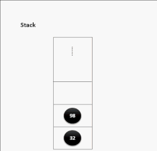
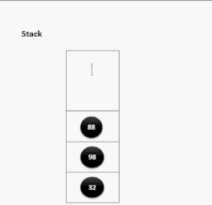

# 数据结构

## 线性结构和非线性结构

数据结构包括：线性结构和非线性结构

### 线性结构：

1. 线性结构作为最常用的数据结构，其特点是数据元素之间存一对一的线性关系
2. 线性结构有两种不同的存储结构，及顺序存储结构和链式存储结构。顺序存储的线性表称为顺序表，顺序表中的存储元素是连续的
3. 链式存储的线性表称为链表，链表中的存储元素不一定是连续的，元素节点中存放数据元素以及相邻元素的地址信息
4. 线性结构常见的有：数组、队列、链表和栈。

### 非线性结构

非线性结构包括：二维数组、多维数组、广义表、树、图。

## 稀疏数组（sparse array）

基本介绍：

当一个数组中大部分元素为0，或者为同一个值的数组时，可以使用稀疏数组来保存该数组。

稀疏数组的处理方法是：

1. 记录数组一共有几行几列，有多少个不同的值
2. 把具有不同值的元素的行列及值记录在一个小规模的数组中，从而缩小程序的规模


二维数组转稀疏数组的思路

1. 遍历原始的二维数组，得到有效数据的个数`sum`

2. 根据`sum`就可以创建稀疏数组`sparseArr= int[sum+1][3]`

3. 将二维数组的有效数据数据存入到稀疏数组

稀疏数组转原始的二维数组的思路

1. 先读取稀疏数组的第一行，根据第一行的数据，创建原始的二维数组，比如上面的 `chessArr2=int[11][11]`
2. 在读取稀疏数组后几行的数据，并赋给原始的二维数组即可。

```java
public class SparseArray {
	public static void main(String[] args) throws IOException {
		/**
		 * 创建一个原始的二维数组 11*11
		 * 0：表示没有棋子，1表示黑子，2表示白子
		 */
		int[][] chessArray = new int[11][11];
		chessArray[1][2] = 1;
		chessArray[2][3] = 2;
		// 输出原始的二维数组
		System.out.println("原始的二维数组:\n");
		toStringArray(chessArray);
		
		/**
		 *  将二维数组转为稀疏数组
		 *  1.先遍历二维数组得到非0数据的个数
		 *  2.创建对应的稀疏数组
		 */
		int effectiveDataCount = 0;
		for(int i = 0; i < 11; i++) {
			for(int j = 0; j<11; j++) {
				if(chessArray[i][j] != 0) {
					effectiveDataCount++;
				}
			}
		}
		/**
		 * 创建对应的稀疏数组,行是有效数据的行数+1
		 * 多出的一行用来存储原二维数组的行和列以及有效数据的个数
		 * 3列是固定值，第一列存储行，第二列存储列，第三列存储实际的值
		 */
		int[][] sparseArray = new int[effectiveDataCount + 1][3];
		// 给稀疏数组赋值，初始化第一行的值
		sparseArray[0][0] = 11;
		sparseArray[0][1] = 11;
		sparseArray[0][2] = effectiveDataCount;
		
		/**
		 * 遍历二维数组，将非0的值存放到稀疏数组中
		 * 再次遍历，如果不进行第一次遍历无法创建稀
		 * 疏数组的大小除非使用集合
		 */
		// 用于记录是第几个非0数据
		int count = 0;
		for(int i = 0; i < 11; i++) {
			for(int j = 0; j<11; j++) {
				if(chessArray[i][j] != 0) {
					count++;
					// 因为count = 0而存值是从第一行开始所以count先++
					sparseArray[count][0] = i;
					sparseArray[count][1] = j;
					sparseArray[count][2] = chessArray[i][j];
				}
			}
		}
		// 输出稀疏数组
		System.out.println("稀疏数组为：\n");
		toStringArray(sparseArray);
		
		/**
		 * 稀疏数组转原始二维数组
		 * 1.先读取稀疏数组的第一行，根据第一行数据创建原始二维数组
		 * 2.读取稀疏数组剩下的行数据，并赋值给原始的二维数组
		 */
		int row = sparseArray[0][0];
		int col = sparseArray[0][1];
		int[][] originalArray = new int[row][col];
		// 遍历稀疏数组剩下的行数据赋值给原始数组,从第二行开始即index=1
		for(int i = 1; i < sparseArray.length; i++) {
			// 获取数据所在原始数组的行号
			int originRow = sparseArray[i][0];
			// 获取数据所在原始数组的列号
			int originCol = sparseArray[i][1];
			// 赋值
			originalArray[originRow][originCol] = sparseArray[i][2];
		}
		System.out.println("稀疏数组恢复原始数组：\n");
		toStringArray(originalArray);
		
		// 将稀疏二维数组写入到文件并读取
		readWriteSparseArray(sparseArray);
	}
	/**
	 * 格式化打印二维数组
	 * @param array
	 */
	private static void toStringArray(int[][] array) {
		for(int[] row : array) {
			for(int data : row) {
				System.out.printf("%d\t", data);
			}
			System.out.println("\n");
		}
	}
	
    /**
	 * 将稀疏矩阵写入到文件并读取出来恢复为稀疏矩阵
	 * @param sparseArray
	 * @throws IOException
	 */
	private static void readWriteSparseArray(int[][] sparseArray) throws IOException {

		// 将稀疏数组保存到文件中在读取出来恢复成稀疏数组
		System.out.println("将稀疏数组写入到map.data");
		BufferedWriter bufferedWriter = new BufferedWriter(new FileWriter("src/map.data"));
		for(int i=0; i < sparseArray.length; i++) {
			for(int j=0; j<3; j++) {
				bufferedWriter.write(sparseArray[i][j]+"\t");
			}
			bufferedWriter.write("\n");
		}
		bufferedWriter.close();
		
		
		BufferedReader bufferedReader = new BufferedReader(new FileReader("src/map.data"));
		String line = bufferedReader.readLine();
		String[] stringArray = line.split("\t");
		int coverRow = Integer.parseInt(stringArray[2]);
		int[][] sparseArray2= new int[coverRow+1][3];
		sparseArray2[0][0] = Integer.parseInt(stringArray[0]);
		sparseArray2[0][1] = Integer.parseInt(stringArray[1]);
		sparseArray2[0][2] = Integer.parseInt(stringArray[2]);
		int readCount = 1;
		String readLine = null;
		while((readLine = bufferedReader.readLine())!= null) {
			String[] temp = readLine.split("\t");
			sparseArray2[readCount][0] = Integer.parseInt(temp[0]);
			sparseArray2[readCount][1] = Integer.parseInt(temp[1]);
			sparseArray2[readCount][2] = Integer.parseInt(temp[2]);
			readCount++;
		}
		System.out.println("恢复后的稀疏数组");
		toStringArray(sparseArray2);
		bufferedReader.close();
	}
}
```

## 队列

1. 队列是一个有序列表，可以用数组或者链表来实现

2. 遵循先进限出的原则，即：先存入对列的数据，要先取出，后存入的元素后取出 


### 数组模拟队列

当我们将数据存入队列时称之为“addQueue”，addQueue的处理需要两个步骤：

1. 将尾指针往后移：rear+1，当front == rear则表示队列为空
2. 若尾指针rear小于队列的最大下标maxSize-1,则将数据存入rear所指的数组元素中，否则无法存入数据，rear == maxSize-1表示队列满了

```java
public class ArrayQueue {
	/**
	 * 数组的最大容量
	 */
	private int maxSize;
	/**
	 * 队头指针
	 */
	private int head;
	/**
	 * 队尾指针
	 */
	private int tail;
	/**
	 * 用于存放数据的容器，模拟队列
	 */
	private int[] element;
	
	// 创建队列的构造器
	public ArrayQueue(int maxSize) {
		this.maxSize = maxSize;
		this.element = new int[maxSize];
		// 初始时element没有元素，head指向队列头部的前一个位置
		this.head = -1;
		// 初始时element没有元素，tail指向队列尾部的后一个位置
		this.tail = -1;
	}
	
	public boolean isFull() {
		return this.tail == this.maxSize -1;
	}
	
	public boolean isEmpty() {
		return this.head == this.tail;
	}
	
	public void add(int elem) {
		if(isFull()) {
			System.out.println("队列满了，无法加入数据");
			return;
		}
		// 后移一位
		tail++;
		this.element[tail] = elem;
	}
	
	public int get() {
		if(isEmpty()) {
			// 通过抛出异常处理
			throw new RuntimeException("队列为空，无法取出数据");
		}
		head++;
		return this.element[head];
	}

	@Override
	public String toString() {
		if(isEmpty()) {
			return "[]";
		}
		return "ArrayQueue [" + Arrays.toString(element) + "]";
	}
	
	/**
	 * 显示队列的头数据，注意不是取数据
	 * @return 返回队头数据
	 */
	public int peek() {
		if(isEmpty()) {
			throw new RuntimeException("队列为空");
		}
		return this.element[head + 1];
	}

	public static void main(String[] args) {
		ArrayQueue queue = new ArrayQueue(3);
		// 测试添加
		queue.add(20);
		queue.add(30);
		
		System.out.println("队列是否满：" + queue.isFull());
		System.out.println("队列是否空：" + queue.isEmpty());
		System.out.println(queue.toString());
	}
}
```

问题分析及优化：

1. 目前数组使用一次就不能在使用了，无法复用
2. 将这个数组使用算法，改进成一个环形队列使用取模方式：%


```java
package xyz.guqing.queue;

import java.util.Arrays;

public class ArrayQueue {
	/**
	 * 数组的最大容量
	 */
	private int maxSize;
	/**
	 * 队头指针
	 */
	private int head;
	/**
	 * 队尾指针
	 */
	private int tail;
	/**
	 * 用于存放数据的容器，模拟队列
	 */
	private int[] element;
	
	// 创建队列的构造器
	public ArrayQueue(int maxSize) {
		this.maxSize = maxSize;
		this.element = new int[maxSize];
		// 初始时element没有元素，head指向队列头部位置也就是第一个元素的位置
		this.head = 0;
		// 初始时element没有元素，tail指向队列尾部的后一个位置，tail = 0
		this.tail = 0;
	}
	
	public boolean isFull() {
		return (tail + 1) % maxSize == head;
	}
	
	public boolean isEmpty() {
		return this.head == this.tail;
	}
	
	public void add(int elem) {
		if(isFull()) {
			System.out.println("队列满了，无法加入数据");
			return;
		}
		// 直接将数据加入即可
		this.element[tail] = elem;
		// 将tail后移一位，这里必须考虑取模
		tail = (tail + 1) % maxSize;
	}
	
	public int get() {
		if(isEmpty()) {
			// 通过抛出异常处理
			throw new RuntimeException("队列为空，无法取出数据");
		}
		// 这里需要分析出head是指向队列的第一个元素
		// 1. 先把head对应的值保存到一个临时的变量
		// 2.将head后移,考虑取模,否则回越界
		// 3.将临时保存的变量返回
		int value = element[head];
		head = (head + 1) % maxSize;
		return value;
	}

	@Override
	public String toString() {
		if(isEmpty()) {
			return "ArrayQueue []";
		}
		// 从head开始遍历，遍历多少个元素,数量是有效数据的个数
		int size = size();
		int count = 0;
		int[] copyArray = new int[size];
		for(int i = head; i < head + size; i++) {
			copyArray[count] = element[i % maxSize];
			count++;
		}
		return "ArrayQueue " + Arrays.toString(copyArray);
	}
	
	public int size() {
		return (tail + maxSize - head) % maxSize;
	}
	
	/**
	 * 显示队列的头数据，注意不是取数据
	 * @return 返回队头数据
	 */
	public int peek() {
		if(isEmpty()) {
			throw new RuntimeException("队列为空");
		}
		return this.element[head];
	}

	public static void main(String[] args) {
		// 传入3，有效数据最大是2，保留了一个
		ArrayQueue queue = new ArrayQueue(3);
		// 测试添加
		queue.add(20);
		queue.add(30);
		
		System.out.println("队列是否满：" + queue.isFull());
		System.out.println("队列是否空：" + queue.isEmpty());
		System.out.println(queue.toString());
		System.out.println("取数据："+queue.peek());
	}
}
```

## 链表

链表是一个有序的列表，但是它在内存中是如下结构的：


1. 链表是以节点的方式来存储的，链式存储
2. 每个节点包含data域和next域，next域指向下一个节点
3. 如图：链表的各个节点不一定是连续存储的
4. 链表分为带头结点的链表和没有头节点的链表，根据实际需求来确定

### 单向链表

#### 代码实现

```java
/**
 * 单链表管理Node
 * @author guqing
 *
 */
public class SingLinkedList<T> {
	// 初始化一个头节点，头节点不能动,不存放具体的数据
	private final Node<T> head = new Node<>(null);
	private transient int size = 0;
	// 添加节点
	public void add(T t) {
		/**
		 * 当不考虑顺序时，找到最后一个节点,让最后一个节点的next指行新节点
		 */
		// 创建数据域节点
		Node<T> node = new Node<>(t);
		// 指针
		Node<T> pointer = head;
		while(pointer.next != null) {
			pointer = pointer.next;
		}
		// 当退出while循环时，pointer就指向了链表的最后
		pointer.next = node;
		size++;
	}
	
	public void remove(T t) {
		// 头节点不能动，需要辅助指针
		// 前驱指针
		Node<T> prevPointer = head;
		// 后继指针
		Node<T> nextPointer = prevPointer.next;
		while(nextPointer != null) {
			if(nextPointer.data == t) {
				// 删除元素
				System.out.println("删除元素");
				prevPointer.next = nextPointer.next;
				nextPointer.next = null;
				size--;
				return;
			}
			prevPointer = nextPointer;
			nextPointer = nextPointer.next;
		}
	}
	
	public T get(int index) {
		if(index > size() - 1) {
			throw new RuntimeException("Array Index Out of Bounds.");
		}
		
		int count = 0;
		Node<T> pointer = head.next;
		while(pointer != null) {
			if(count == index) {
				return pointer.data;
			}
			count++;
			pointer = pointer.next;
		}
		return null;
	}
	
	public int size() {
		return size;
	}

	public void remove(int index) {
		if(index > size() - 1) {
			throw new RuntimeException("Array Index Out of Bounds.");
		}
		
		int count = 0;
		// 前驱指针
		Node<T> prevPointer = head;
		// 后继指针
		Node<T> nextPointer = prevPointer.next;
		while(nextPointer != null) {
			if(count == index) {
				prevPointer.next = nextPointer.next;
				nextPointer.next = null;
				// 更新链表长度
				size--;
				return;
			}
			count++;
			prevPointer = nextPointer;
			nextPointer = nextPointer.next;
		}
	}
	
	public void addAll(SingLinkedList<T> list) {
		Node<T> pointer = head.next;
		while(pointer.next != null) {
			pointer = pointer.next;
		}
		// 追加在链表尾
		pointer.next = list.head.next;
		size = size + list.size();
	}
	
	@Override
	public String toString() {
		// 判断链表是否为空
		if(head.next == null) {
			return "[]";
		}
		// 因为头节点不能动，因为我们需要一个指针来遍历
		Node<T> pointer = head.next;
		StringBuilder sb = new StringBuilder();
		sb.append("[");
		while(pointer != null) {
			// 输出节点信息
			sb.append(pointer.data);
			
			// 指针后移
			pointer = pointer.next;
			
			// 添加一个分割符
			if(pointer != null) {
				sb.append(", ");
			}
		}
		sb.append("]");
		return sb.toString();
	}
	
	/**
	 * Node类用于定义链表的基本结构包括两个域：数据域和指针域
	 * @author guqing
	 * @param <T> 数据类型
	 */
	private static class Node<T> {
		final T data;
		Node<T> next;
		
		public Node(T data) {
			super();
			this.data = data;
		}
	}

	public static void main(String[] args) {
		SingLinkedList<User> userList = new SingLinkedList<>();
		User user1 = new User();
		user1.setId(1);
		user1.setUsername("zhangsan");
		user1.setNickname("张三");
		user1.setGender("男");
		userList.add(user1);
		
		User user2 = new User();
		user2.setId(2);
		user2.setUsername("lisi");
		user2.setNickname("李四");
		user2.setGender("男");
		userList.add(user2);
		
		User user3 = new User();
		user3.setId(3);
		user3.setUsername("cuihua");
		user3.setNickname("翠花");
		user3.setGender("女");
		userList.add(user3);
		System.out.println("size:" + userList.size());
		System.out.println(userList);
	}
}
```

其中用到的User类

```java
public class User {
	private Integer id;
	private String username;
	private String nickname;
	private String gender;
}
```

#### 常见单链表题目

1. 查找单链表的倒数第k个节点使用 `T get(int index)`方法即可,比如获取倒数第`1`个节点：

```java
User user = userList.get(userList.size() - 1);
```

2. 链表反转，这里写两种方式，还有一种递归反转不会

```java
/**
 * 迭代头插法反转链表,遍历一个反转一个
 */
public void reverse() {
    //如果链表为空或只有一个元素直接返回
    if(head.next == null || head.next.next == null){
        return;
    }
    // 新的头节点，让其next指向null
    Node<T> newHead = new Node<T>(null);
    newHead.next = null;

    // 用于临时保存head的next指向
    Node<T> temp = null;
    while(head != null){
        // 临时保存head的next指向
        temp = head.next;

        // 头部插入，先让head.next指向newHead.next,在链接头部和新节点
        head.next = newHead.next;
        newHead.next = head;

        // 让head重新指向temp,达到向后移动遍历的目的
        head = temp;
    }

    // 这里需要将head重新指向新的head处，否则head指向null
    head = newHead;
}


/**
 * 指针的next指向逆向法反转链表
 */
public void reverse1() {
    //如果链表为空或只有一个元素直接返回
    if(head.next == null || head.next.next == null){
        return;
    }
    // 使用一个新head指行原head指向的位置，这样方便修改原head的指向
    Node<T> newHead = head;
    // 指向head第一个有数据的Node
    Node<T> prevPointer = newHead.next;
    // 指向prevPointer的下一个指针，因此如果数据都没有两个是不需要逆序的
    Node<T> nextPointer = prevPointer.next;
    // 临时指针
    Node<T> temp = null;
    while(nextPointer != null){
        temp = nextPointer.next;
        nextPointer.next = prevPointer;
        prevPointer = nextPointer;
        nextPointer = temp;
    }
    //设置链表尾
    newHead.next.next = null;
    //修改链表头
    newHead.next = prevPointer;
    head = newHead;
}
```

3. 逆序打印单链表

方式1：先将单链表进行反转在遍历（破坏了单链表的结构，不建议）

方式2：利用栈，将各个节点压入栈中，在弹栈。利用栈先进后出的特点

（还没有涉及到栈，先不实现，也可以用jdk的Stack）

#### 单向链表的缺点

1. 单向链表，查找方向只能是一个方向
2. 单向链表不能自我删除，需要靠辅助节点

### 双向链表

双向链表的结构包含两个指针，一个指向前一个节点的前驱指针和一个指向下一个节点的后继指针。


双向链表的遍历、添加、删除的操作思路：

1. 遍历方式和单链表一样，但是既可以向前查找也可以向后查找
2. 添加（默认添加到双向链表的最后）
3. 删除：因为是双向链表，因此可以实现自我删除某个节点，直接找到要删除的某个节点，比如指向删除数据的指针为pointer,则

```java
//删除的不是最后一个节点否则回出现空指针
pointer.prev.next = pointer.next
pointer.next.prev = pointer.prev

// 删除的是最后一个节点
pointer.prev.next = pointer.next
```

#### 代码实现

```java
/**
 * 双向链表代码实现:
 * void add(T t)
 * void addAll(DoubleLinkedList list)
 * void remove(T t)
 * void remove(int index)
 * T get(int index)
 * int size()
 * String toString()
 * 
 * @author guqing
 */
public class DoubleLinkedList<T> {
	private Node<T> head = new Node<>(null);
	private int size = 0;
	
	public void add(T t) {
		/**
		 * 当不考虑顺序时，找到最后一个节点,让最后一个节点的next指向新节点
		 */
		// 创建数据域节点
		Node<T> node = new Node<>(t);
		// 指针
		Node<T> pointer = head;
		while(pointer.next != null) {
			pointer = pointer.next;
		}
		// 当退出while循环时，pointer就指向了链表的最后
		pointer.next = node;
		node.prev = pointer;
		size++;
	}
	
	public void addAll(DoubleLinkedList<T> list) {
		Node<T> pointer = head.next;
		while(pointer.next != null) {
			pointer = pointer.next;
		}
		// 追加在链表尾
		pointer.next = list.head.next;
		list.head.next.prev = pointer;
		// 更新链表的长度
		size = size + list.size();
	}
	/**
	 * 双向链表可以自我删除，不需要前驱指针
	 * @param t 需要删除的对象
	 */
	public void remove(T t) {
		// 头节点不能动，需要辅助指针
		Node<T> pointer = head.next;
		while(pointer != null) {
			if(pointer.data == t && pointer.next != null) {
				// 删除元素
				pointer.prev.next = pointer.next;
				pointer.next.prev = pointer.prev;
				size--;
				return;
			} else if(pointer.data == t) {
				// 删除最后一个元素
				pointer.prev.next = pointer.next;
				size--;
				return;
			}
			pointer = pointer.next;
		}
	}
	
	public void remove(int index) {
		if(index > size() - 1) {
			throw new RuntimeException("Array Index Out of Bounds.");
		}
		
		int count = 0;
		// 遍历指针
		Node<T> pointer = head.next;
		while(pointer != null) {
			if(count == index && count < size -1) {
				pointer.prev.next = pointer.next;
				pointer.next.prev = pointer.prev;
				// 更新链表长度
				size--;
				return;
			} else if(count == index){
				// 删除最后一个节点
				pointer.prev.next = pointer.next;
				size--;
				return;
			}
			count++;
			pointer = pointer.next;
		}
	}
	
	public T get(int index) {
		if(index < 0 || index > size() - 1) {
			throw new RuntimeException("Array Index Out of Bounds.");
		}
		
		int count = 0;
		Node<T> pointer = head.next;
		while(pointer != null) {
			if(count == index) {
				return pointer.data;
			}
			count++;
			pointer = pointer.next;
		}
		return null;
	}
	
	public int size() {
		return size;
	}
	
	@Override
	public String toString() {
		// 判断链表是否为空
		if(head.next == null) {
			return "[]";
		}
		// 因为头节点不能动，因为我们需要一个指针来遍历
		Node<T> pointer = head.next;
		StringBuilder sb = new StringBuilder();
		sb.append("[");
		while(pointer != null) {
			// 输出节点信息
			sb.append(pointer.data);
			
			// 指针后移
			pointer = pointer.next;
			
			// 添加一个分割符
			if(pointer != null) {
				sb.append(", ");
			}
		}
		sb.append("]");
		return sb.toString();
	}
	
	/**
	 * Node类用于定义双向链表的基本结构包括三个域：数据域和前驱指针域和后继指针域
	 * @author guqing
	 * @param <T> 数据类型
	 */
	private static class Node<T> {
		final T data;
		Node<T> prev;
		Node<T> next;
		
		public Node(T data) {
			super();
			this.data = data;
		}
	}
	
	public static void main(String[] args) {
		DoubleLinkedList<User> userList = new DoubleLinkedList<>();
		
		User user1 = new User();
		user1.setId(1);
		user1.setUsername("zhangsan");
		user1.setNickname("张三");
		user1.setGender("男");
		userList.add(user1);
		
		User user2 = new User();
		user2.setId(2);
		user2.setUsername("lisi");
		user2.setNickname("李四");
		user2.setGender("男");
		userList.add(user2);
		
		User user3 = new User();
		user3.setId(3);
		user3.setUsername("cuihua");
		user3.setNickname("翠花");
		user3.setGender("女");
		userList.add(user3);
		
		userList.remove(user1);
		System.out.println(userList);
	}
}
```

### 单向循环链表

`Josephu`（约瑟夫、约瑟夫环）问题：

> `Josephu`问题为：设编号为1，2，…n的n个人围坐一圈，约定编号为k（1<=k<=n）的人从1开始报数，数到m的那个人出列，它的下一位又从1开始报数，数到m的那个人又出列，依次类推，直到所有人出列为止，由此产生一个出队编号的序列。
> **提示**：用一个不带头结点的循环链表来处理 `Josephu`问题：先构成一个有n个结点的单循环链表，然后由k结点起从1开始计数，计到m时，对应结点从链表中删除，然后再从被删除结点的下一个结点又从1开始计数，直到最后一个结点从链表中删除算法结束。


构建一个单向循环链表思路：

1. 先创建第一个节点，让head指向该节点，并形成环形。
2. 然后当我们每创建一个新的节点，就把该节点加入到已有的环形链表中即可

遍历环形链表

1. 先让一个辅助指针pointer（变量），指向head节点
2. 然后通过一个while循环遍历该环形链表即可遍历结束的条件`pointer.next == head`

#### 约瑟夫问题代码

使用不带头节点的单向循环链表完成

```java
/**
 * 没有头节点的单向循环链表（解决约瑟夫环问题）
 * @author guqin
 *
 */
public class JosephLinkedList<T> {
	private Node<T> head = null;
	private int size = 0;
	
	public JosephLinkedList() {
	}
	
	public int size() {
		return size;
	}
	
	/**
	 * 添加数据的方法
	 * @param t 数据
	 */
	public void add(T t) {
		Node<T> data = new Node<>(t);
		if(size == 0) {
			head = data;
			data.next = data;
			size++;
			return;
		}
		//辅助指针，用于构建环形链表,注意:这里指向head，判断条件是pointer.next不是head
		Node<T> pointer = head;
		while(pointer.next != head) {
			pointer = pointer.next;
		}
		// 遍历到最后一个节点，添加数据并后成环
		pointer.next = data;
		data.next = head;
		size++;
	}
	
	@Override
	public String toString() {
		// 判断链表是否为空
		if(head == null) {
			return "[]";
		}
		
		// 遍历时需要取数据所以要指向第一个有数据的节点
		Node<T> pointer = head;
		StringBuilder sb = new StringBuilder();
		sb.append("[");
		while(pointer.next != head) {
			sb.append(pointer.data);
			sb.append(", ");
			
			// 移动指针
			pointer = pointer.next;
		}
		// 头节点的数据
		sb.append(pointer.data);
		sb.append("]");
		
		return sb.toString();
	}
	
	
	/**
	 * 约瑟夫问题出队序列方法
	 * 1.需要创建一个辅助指针pointer,事先应该指向环形链表的最后一个节点
	 * 2.从第k个元素开始数，数m次第m个元素被取出
	 * @param k 从第几个节点开始遍历
	 * @param m 遍历几个后取出节点
	 * @return 返回约瑟夫出队序列的字符串
	 */
	public String fetchSequence(int k, int m) {
		// 判断链表是否为空
		if(head.next == head) {
			return "[" + head.data + "]";
		}
		
		if(k < 1 || k > size -1) {
			throw new RuntimeException("Array Index Out of Bounds.");
		}
		int count = 1;
		Node<T> pointer = head.next;
		while(count != size) {
			head = pointer;
			pointer = pointer.next;
			count++;
		}
		// 至此head指向头节点的前一个节点
		while(k != 1){
			head = pointer;
			pointer = pointer.next;
			k--;
		}
		StringBuilder sb = new StringBuilder();
		sb.append("[");
		while(head != pointer) {
			for(int i=1; i<m;i++) {
				head = pointer;
				pointer = pointer.next;
			}
			// 此时pointer指针指向的位置就是需要弹出的节点
			sb.append(pointer.data);
			sb.append(", ");
			// 该节点已经输出将其删除
			// head指针指向的节点的next指向pointer的next
			head.next = pointer.next;
			// pointer指向pointer的next
			pointer = pointer.next;
		}
		sb.append(pointer.data);
		sb.append("]");
		return sb.toString();
	}
	
	/**
	 * 节点对象存储数据和指针
	 * @author guqin
	 * @param <T>
	 */
	private static class Node<T> {
		T data;
		Node<T> next;
		public Node(T data) {
			super();
			this.data = data;
		}
		@Override
		public String toString() {
			return "Node [data=" + data + "]";
		}
		
	}
	
	public static void main(String[] args) {
		JosephLinkedList<Integer> list = new JosephLinkedList<>();
		for(int i=1; i<=10; i++) {
			list.add(i);
		}
		String result = list.fetchSequence(2, 4);
		System.out.println(result);
	}
}
```

## 栈

1. 栈的英文为`stack`
2. 栈时一个先进后出的有序列表(`FILO:First In Last Out`)
3. 栈是限制线性表中元素的插入和删除只能在线性表的同一端进行的一种特殊线性表。允许插入和删除的一端为变化的一端，称为栈顶(Top)，另一端为固定的一端，称栈低(Bottom)
4. 根据栈的定义可知，最先放入栈中元素在栈低，最后放入的元素在栈顶，而删除元素刚好相反，最后放入的元素最先删除，最后放入的元素最后删除
5. 相关术语：压栈（将元素存如栈中）、弹栈（从栈中取出元素）

压栈演示：



出栈演示：



栈的应用场景

1. 子程序的调用：在跳往子程序之前，回先将下一个指令的地址存入栈中，直到子程序编写执行完后再将地址取出。
2. 处理递归调用：和子程序的调用类似，只是除了存储下一个指令的地址外，也将参数、区域变量等数据存入栈中。
3. 表达式的转换与求值
4. 二叉树遍历
5. 图的深度优先搜索(depth first)

###  代码实现

#### 使用数组实现栈

思路分析：

1. 定义一个top变量表示栈顶，初始化为-1
2. 入栈的操作，当有数据加入到栈时，`top++，stack[top] = data;`
3. 出栈操作,保存栈顶元素然后移动栈顶并返回数据

```
int value = stack[top];
top--;
return value;
```

代码实现：

```java
/**
 * 使用数组实现栈
 * @author guqing
 *
 */
public class ArrayStack {
	/**
	 * 栈的大小
	 */
	private int maxSize;
	/**
	 * 数组模拟栈，数据存放到该int数组中
	 */
	private int[] stack;
	/**
	 * top表示栈顶，初始化为-1即栈中没有数据
	 */
	private int top = -1;
	
	public ArrayStack(int maxSize) {
		this.maxSize = maxSize;
		this.stack = new int[maxSize];
	}
	
	/**
	 * 判断栈是否满
	 * @return 栈满返回true，否则返回false
	 */
	public boolean isFull() {
		return top == maxSize;
	}
	
	/**
	 * 判断栈是否为空
	 * @return 栈为空返回true，否则返回false
	 */
	public boolean isEmpty() {
		return top == -1;
	}
	
	/**
	 * 压栈
	 * @param value 需要存入栈顶的数据
	 */
	public void push(int value) {
		if(isFull()) {
			System.out.println("栈已经满了无法再压入数据");
			return;
		}
		// 栈顶先挪一个位置
		top++;
		// 再将数据压入栈顶
		this.stack[top] = value;
	}
	
	/**
	 * 出栈，返回栈顶元素
	 * @return 返回栈顶元素
	 */
	public int pop() {
		if(isEmpty()) {
			throw new RuntimeException("栈为空无法取出数据");
		}
		// 先保存栈顶数据
		int value = this.stack[top];
		// 栈顶-1
		top--;
		return value;
	}
	
	/**
	 * 遍历栈,从栈顶开始遍历
	 */
	@Override
	public String toString() {
		if(isEmpty()) {
			return "[]";
		}
		StringBuilder sb = new StringBuilder();
		sb.append("stack [");
		for(int i = top; i >= 0; i--) {
			sb.append(stack[i]);
			
			if(i != 0) {
				sb.append(", ");
			}
		}
		sb.append("]");
		return sb.toString();
	}
	
	public static void main(String[] args) {
		ArrayStack stack = new ArrayStack(5);
		// 压栈
		stack.push(10);
		stack.push(5);
		stack.push(20);
		stack.push(8);
		stack.push(6);
		
		// 打印栈
		System.out.println(stack);
		
		// 弹栈
		for(int i=4; i>=0; i--) {
			int value = stack.pop();
			System.out.println("栈顶元素：" + value);
		}
	}
}
```

运行结果：

```
stack [6, 8, 20, 5, 10]
栈顶元素：6
栈顶元素：8
栈顶元素：20
栈顶元素：5
栈顶元素：10
```

#### 栈的链表方式实现

```java
/**
 * 使用链表实现栈
 * @author guqing
 */
public class LinkedStack<T> {
	private Node<T> top;
	private int size;
	
	public boolean isEmpty() {
		return top == null;
	}
	
	public int size() {
		return size;
	}
	
	/**
	 * 压栈
	 */
	public void push(T t) {
		Node<T> node = new Node<T>(t);
		if(isEmpty()) {
			node.next = null;
			top = node;
			size++;
			return;
		}
		// 让新节点的next指向栈顶元素，栈顶指针指向新栈顶
		node.next = top;
		top = node;
		size++;
	}
	
	
	public T pop() {
		if(isEmpty()) {
			return null;
		}
		T data = top.data;
		// 临时指针指向栈顶元素
		Node<T> pointer = top;
		// 栈顶指向下一个元素
		top = top.next;
		// 将原栈顶的元素的next指针指向空，即删除栈顶元素，对象没有引用会被垃圾回收
		pointer.next = null;
		size--;
		return data;
	}
	
	@Override
	public String toString() {
		if(isEmpty()) {
			return "[]";
		}
		Node<T> pointer = top;
		StringBuilder sb = new StringBuilder();
		sb.append("[");
		while(pointer != null) {
			sb.append(pointer.data);
			sb.append(",");
			pointer = pointer.next;
		}
		int commaIndex = sb.lastIndexOf(",");
		sb.delete(commaIndex, commaIndex + 2);
		sb.append("]");
		return sb.toString();
	}
	
	private static class Node<T> {
		private T data;
		private Node<T> next;
		public Node(T data) {
			super();
			this.data = data;
		}
	}
	
	public static void main(String[] args) {
		LinkedStack<Integer> stack = new LinkedStack<>();
		stack.push(17);
		stack.push(9);
		stack.push(20);
		stack.push(5);
		System.out.println("size: "+stack.size() + ", 栈结构: " + stack);
		// 弹栈
		Integer value = stack.pop();
		System.out.println("栈顶元素: "+value);
		System.out.println("size: "+stack.size() + ", 栈结构: " + stack);
	}
}
```

当然遍历还可以实现一个`Iterator`迭代器，其他相似方法省略主要方法如下：

```java
// 让LinkedStack实现Iterable方法，并实现里面的iterator方法
public class LinkedStack<T> implements Iterable<T>{
    @Override
	public Iterator<T> iterator() {
		return new ListIterator();
	}
    
    /**
	 * 自定义内部类实现Iterator方法完成栈的迭代器
	 * @author guqing
	 */
	private class ListIterator implements Iterator<T>{
		private Node<T> pointer = top;
		
		@Override
		public boolean hasNext() {
			return pointer != null;
		}

		@Override
		public T next() {
			T data = pointer.data;
			pointer = pointer.next;
			return data;
		}
	}
}
```

测试:

```java
public static void main(String[] args) {
    LinkedStack<Integer> stack = new LinkedStack<>();
    stack.push(17);
    stack.push(9);
    stack.push(20);
    stack.push(5);
    // 使用迭代器遍历
    Iterator<Integer> it = stack.iterator();
    while(it.hasNext()) {
        System.out.println(it.next());
    }
}
```

#### 前缀、中缀、后缀表达式

1. 前缀表达式也称为波兰表达式，前缀表达式的运算符
2. 举例说明：``(3+4)X5-6`,对应的前缀表达式就是`- X + 3 4 5 6`

**前缀表达式的计算机求值**

从左至右扫描表达式，遇到数字时，将数字压入堆栈，遇到运算符时，弹出栈顶的两个数，用运算符对他们做相应的计算（栈顶元素和次项元素），并将结果入栈；重复上述过程知道表达式的最左端，最后运算得出的值即为表达式的结果

例如：`(3+4)X5-6`对应的前缀表达式就是`- X + 3 4 5 6`,针对前缀表达式求值步骤如下：

1. 从右至左扫描，6、5、4、3压入堆栈
2. 遇到+运算符，因此弹出的`3`和`4`（3为栈顶元素，4为次项元素），计算出`3+4`的值，得到7再将7入栈
3. 接下来是`X`运算符，因此弹出`7`和`5`，计算出`7X5=35`，将`35`压入栈
4. 最后是运算符，计算出35-6的值，即29，由此得出最终结果

**中缀表达式**

1. 中缀表达式的求职就是最常见的运算表达式，如`(3+4)X5-6`
2. 中缀表达式的求值是我们人最熟悉的，但是对计算机来说却不好操作，因此，再计算结果时，往往会将中缀表达式转换成其他表达式来操作（一般转后缀表达式）。

**后缀表达式**

1. 后缀表达式又称为逆波兰表达式，与前缀表达式相似，知识运算符位于操作数之后。
2. `(3+4)X5-6`对应的后缀表达式就是 `3 4 + 5 X 6 - `

**后缀表达式的计算机求值**

从左至右扫描表达式，遇到数字时，将数字压入堆栈，遇到运算符时，弹出栈顶的两个数，用运算符对他们做相应的计算（次顶元素和栈顶元素），并将结果入栈，重复上述过程知道表达式最右端，最后运算得出的值即为表达式的结果。

例如：`(3+4)X5-6`对应的前缀表达式是`3 4 + 5 X 6 -`,针对后缀表达式求值步骤如下：

1. 从左至右扫描，将3和4压入堆栈
2. 遇到+运算符，因此弹出`4`和`3`(4为栈顶元素，3为次顶元素)，计算出`3+4`的值，得7入栈
3. 将5入栈
4. 接下来是X运算符，因此弹出5和7，计算`7X5=35`入栈
5. 将`6`入栈
6. 最后是运算符，计算出`35-6`得值，即29，由此得出最终结果

#### 逆波兰计算器

完成后缀表达式的计算器

1. 输入一个逆波兰表达式，使用栈(stack)，计算其结果
2. 支持小括号和多位数整数，因为这里我们主要讲的是数据结构，因此计算器进行简化，只支持对整数的计算。

```java
/**
 * 使用栈完成逆波兰计算器
 * @author guqing
 * @date 2019/9/4
 */
public class ReversePolish {
	public static void main(String[] args) {
		/**
		 * 先定义一个逆波兰表达式
		 * (3+4)*5-6 => 3 4 + 5 * 6 - => 29
		 * (30+4)*5-6 => 30 4 + 5 * 6 => 164
		 * 使用空格隔开方便处理
		 */
		String suffixExpression1 = "3 4 + 5 * 6 -";
		String suffixExpression2 = "30 4 + 5 * 6 -";
		
		// 1.先将suffixExpression装入一个ArrayList中
		List<String> rpList = getList(suffixExpression2);
		// 2.使用ArrayList传递给一个方法，遍历配合栈完成计算
		int result = calculate(rpList);
		System.out.println("计算结果：" + result);
	}
	
	/**
	 * 将逆波兰表达式，依次将数据和运算符放入ArrayList
	 */
	public static List<String> getList(String suffixExpression) {
		// 将suffixExpression分割
		String[] splitArray = suffixExpression.split(" ");
		// 转成list，注意这种方式转成的list和真正的List的区别
		return Arrays.asList(splitArray);
	}
	/**
	 * 1.从左至右扫描，将3和4压入堆栈
	 * 2.遇到+运算符，弹出4和3(4是栈顶元素，3是次栈顶元素)，计算出3+4的值得到7，再将7入栈
	 * 3.将5入栈
	 * 4.接下来是*运算符，因此弹出5和7，计算出7*5=35，将35入栈
	 * 5.将6入栈
	 * 6.最后是-运算符，计算出35-6的值即29，由此得出最终结果
	 * @param list 存储着逆波兰表达式每个元素的字符串集合
	 * @return 返回逆波兰计算器的计算结果
	 */
	public static int calculate(List<String> list) {
		// 创建一个栈
		Stack<String> stack = new Stack<String>();
		// 遍历list
		for(String item : list) {
			// 正则匹配数字
			if(item.matches("\\d+")) {
				// 将数字入栈
				stack.push(item);
			} else {
				// 由于当前是else说明item是一个符号
				// pop出两个数，并计算，再入栈
				int num2 = Integer.parseInt(stack.pop());
				int num1 = Integer.parseInt(stack.pop());
				
				// 计算
				int result = switchCalc(item, num1, num2);
				// 入栈
				stack.push(result + "");
			}
		}
		return Integer.parseInt(stack.pop());
	}
	
	public static int switchCalc(String item, int num1, int num2) {
		int result = 0;
		switch (item) {
		case "+":
			result = num1 + num2;
			break;
		case "-":
			result = num1 - num2;
			break;
		case "*":
			result = num1 * num2;
			break;
		case "/":
			result = num1 / num2;
			break;
		case "%":
			result = num1 % num2;
			break;
		default:
			break;
		}
		return result;
	}
}
```

